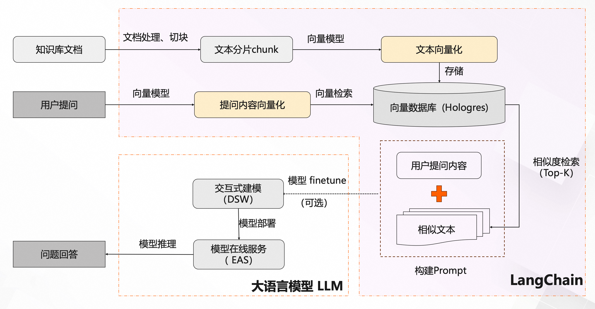
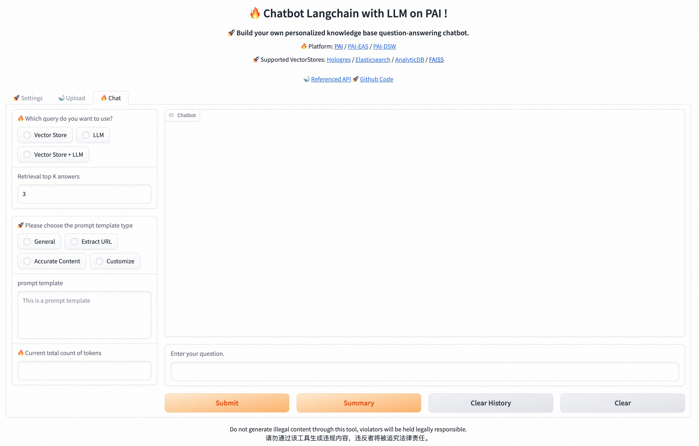

# PAI-RAG: 基于大语言模型和多向量数据库的知识库问答系统白盒化解决方案

- 支持多种向量数据库: Hologres、Elasticsearch、OpenSearch、AnalyticDB、以及本地FAISS向量库
- 支持多种向量化模型(中文、英文、多语言): SGPT-125M, text2vec-large-chinese, text2vec-base-chinese, paraphrase-multilingual, OpenAIEmbeddings
- 支持任意基于PAI-EAS部署的大模型服务: Qwen, chatglm, llama2, baichuan等系列模型，同时支持ChatGPT调用（需提供OpenAI Key）
- 部署参考链接：[PAI+向量检索快速搭建大模型知识库对话](https://help.aliyun.com/zh/pai/use-cases/use-pai-and-vector-search-to-implement-intelligent-dialogue-based-on-the-foundation-model?spm=a2c4g.11186623.0.0.4510e3efQRyPdt)

## PAI-RAG白盒化解决方案系统架构图

- Step1: 文档处理、切片，针对文本进行不同格式和长度的切分
- Step2: 文本向量化，导入到向量数据库
- Step3: 用户Query向量化，并进行向量相似度检索，获取Top-K条相似文本块
- Step4: 将用户query和Top-K条文本块基于上下文构建Prompt
- Step5: 大模型推理回答，必要时可以finetune模型

### 白盒化自建方案与一体化方案对比

| 维度 | 白盒化自建 | 一体化方案 | 
| ------- | ------- | ------- |
| 模型灵活度 | 支持多种中英文开源模型，如llama2, baichuan, ChatGLM，Qwen，mistral等系列模型，也支持通过API方式调用的模型，比如OpenAI，Gemini各种API | 仅支持内嵌大模型 |
| 模型推理加速 | 支持vLLM、 flash-attention等大模型推理加速框架 | 一般不支持 |
| 向量数据库 | 支持多种向量数据库: Hologres、Elasticsearch、OpenSearch、AnalyticDB、以及本地FAISS向量库 | 仅支持内置 | 
| 业务数据Finetune | 支持 | 一般不支持 |
| Embedding模型 | 支持多种中文/英文/多语言向量模型以及不同的向量维度 | 内置为主，有限的官方和开源模型 |
| 超参数调整 | 支持多种超参数调整，如文档召回参数、模型推理参数 | 有的仅支持temperature和topK |
| Prompt模板 | 提供多种Prompt Template：General, Exreact URL, Accurate Content, 支持用户自定义Prompt| 不支持 |
| 知识库文件格式及上传方式 | 支持多种文件格式：txt、pdf、doc、markdown等, 支持多个文件同时上传, 支持整个文件夹上传 | 文件格式支持txt、doc、pdf、html、json, 只能单个文件上传 |
| 文本处理 | 可根据实际文本情况自定义切块方式: 切块大小 chunk size, 重叠大小 overlap size | 基于段落拆分模型，仅支持默认中文分词器，不能调整 |

## Step 1: 开发环境

### 方案一：本地conda安装

1. 创建虚拟环境，并安装依赖
```bash
conda create --name llm_py310 python=3.10
conda activate llm_py310

git clone https://github.com/aigc-apps/LLM_Solution.git
cd LLM_Solution

sh install.sh
pip install --upgrade -r requirements.txt
```

2. 下载RefGPT模型以供后续对HTML文件进行QA提取
```bash
wget http://atp-modelzoo-sh.oss-cn-shanghai.aliyuncs.com/release/langchain/refgpt.tar.gz
tar -xzvf refgpt.tar.gz && rm -rf refgpt.tar.gz
```

### 方案二：Docker启动

1. 拉取已有的docker环境，防止因环境安装失败导致的不可用
```bash
docker pull registry.cn-beijing.aliyuncs.com/mybigpai/aigc_apps:env
```

2. 启动docker
```bash
sudo docker run -t -d --network host  --name llm_docker registry.cn-beijing.aliyuncs.com/mybigpai/aigc_apps:env
docker exec -it llm_docker bash
cd /code/LLM_Solution
```

3. 最新代码需要挂载本地目录到docker中

4. 下载RefGPT模型以供后续对HTML文件进行QA提取
```bash
wget http://atp-modelzoo-sh.oss-cn-shanghai.aliyuncs.com/release/langchain/refgpt.tar.gz
tar -xzvf refgpt.tar.gz && rm -rf refgpt.tar.gz
```

## Step 2: 运行启动WebUI

```bash
uvicorn webui:app --host 0.0.0.0 --port 8000
```
看到如下界面即表示启动成功


### 2.1 页面配置

- **Emebdding Model Config**: 根据实际情况配置，不同model对应的向量维度(embedding dimension)不同。
  - SGPT-125M-weightedmean-nli-bitfit: 768
  - text2vec-large-chinese: 1024
  - text2vec-base-chinese: 768
  - paraphrase-multilingual-MiniLM-L12-v2: 368
  - OpenAIEmbeddings(text-embedding-ada-002): 1536

- **LLM Config**: 使用PAI-EAS部署LLM大模型推理服务，并获取URL和token填入。
  - [5分钟使用EAS一键部署LLM大语言模型应用](https://help.aliyun.com/zh/pai/use-cases/deploy-llm-in-eas?spm=a2c4g.11186623.0.0.3f5b446e79KaHf)

- **Vector Store Config**: 根据实际情况，选择所需的向量数据库进行配置
  - 如何配置向量数据库请参考[PAI+向量检索快速搭建大模型知识库对话：步骤一](https://help.aliyun.com/zh/pai/use-cases/use-pai-and-vector-search-to-implement-intelligent-dialogue-based-on-the-foundation-model?spm=a2c4g.11186623.0.0.4510e3efQRyPdt)

### 2.2 知识库上传

- **文档上传**：
  - 支持多种文件格式：txt、pdf、doc、markdown等
  - 支持多个文件同时上传
  - 支持一个目录文件上传
  
- **文本处理**：
  - chunk size: 块大小（将文档划分成的块的大小）
  - overlap size: 块重叠大小（相邻文档块彼此重叠的部分）

### 2.3 聊天问答

- 支持不同问答方式: VectorStore, LLM, Langchain(VectorStore+LLM)
- 支持多种不同的推理参数调优：
  - 文档召回参数: 
    - Top-K: 根据相似度分数召回K条最相关的文本块
    - ScoreThreshold: 设置召回文本块的相似度分数阈值
  - 模型推理参数: 
    - Top K: 从tokens里选择k个作为候选，然后根据它们的likelihood scores来采样。值越大，生成的内容可能性越大；值越小，生成的内容越固定。
    - Top P: 候选词列表是动态的，从tokens里按百分比选择候选词
    - Temperature: 用于控制模型输出的结果的随机性，值越大随机性越大
- 支持多种Prompt Template和用户自定义:
  - General: ```基于以下已知信息，简洁和专业的来回答用户的问题。如果无法从中得到答案，请说 "根据已知信息无法回答该问题" 或 "没有提供足够的相关信息"，不允许在答案中添加编造成分，答案请使用中文。 ===== 已知信息: {context}  ===== 用户问题: {question}```
  - Exreact URL: ```你是一位智能小助手，请根据下面我所提供的相关知识，对我提出的问题进行回答。回答的内容必须包括其定义、特征、应用领域以及相关网页链接等等内容，同时务必满足下方所提的要求！===== 知识库相关知识如下: {context} ===== 请根据上方所提供的知识库内容与要求，回答以下问题: {question}```
  - Accurate Content: ```你是一位知识小助手，请根据下面我提供的知识库中相关知识，对我提出的若干问题进行回答，同时回答的内容需满足我所提的要求! ===== 知识库相关知识如下: {context} ===== 请根据上方所提供的知识库内容与要求，回答以下问题: {question}```
  - Customize: 支持用户自定义
- 支持上下文聊天: ```With Chat History = True```
- 支持对话总结: Summary
