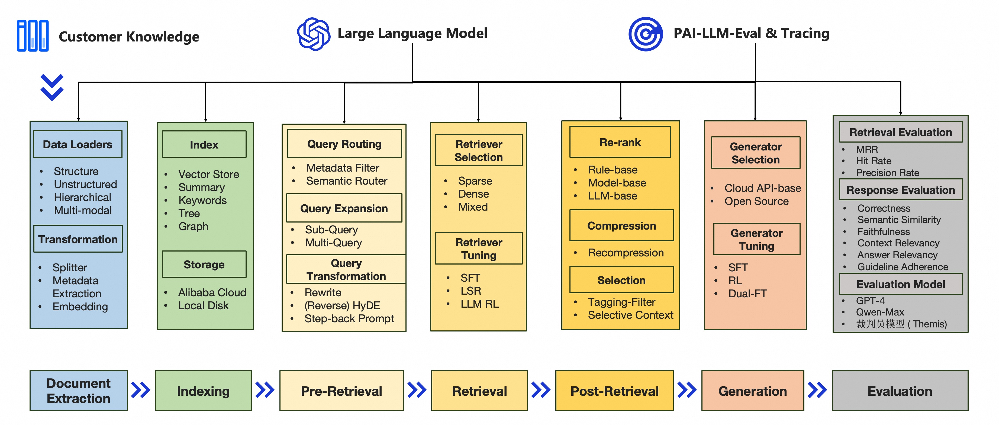

<p align="center">
    <h1>PAI-RAG: An easy-to-use framework for modular RAG </h1>
</p>

[](https://github.com/aigc-apps/PAI-RAG/actions/workflows/ci.yml)

<p align="center">
  <a href="./README.md">English</a> |
  <a href="./README_zh.md">简体中文</a> |
</p>

<details open>
<summary></b>📕 Contents</b></summary>

- 💡 [What is PAI-RAG?](#what-is-pai-rag)
- 🌟 [Key Features](#key-features)
- 🔎 [Get Started](#get-started)
  - [Local](#run-in-local-environment)
  - [Docker](#run-in-docker)
- 🔧 [API Service](#api-service)

</details>

# 💡 What is PAI-RAG?

PAI-RAG is an easy-to-use opensource framework for modular RAG (Retrieval-Augmented Generation). It combines LLM (Large Language Model) to provide truthful question-answering capabilities, supports flexible configuration and custom development of each module of the RAG system. It offers a production-level RAG workflow for businesses of any scale based on Alibaba Cloud's Platform of Artificial Intelligence (PAI).

# 🌟 Key Features



- Modular design, flexible and configurable
- Built on community open source components, low customization threshold
- Multi-dimensional automatic evaluation system, easy to grasp the performance quality of each module
- Integrated llm-based-application tracing and evaluation visualization tools
- Interactive UI/API calls, convenient iterative tuning experience
- Alibaba Cloud fast scenario deployment/image custom deployment/open source private deployment

# 🔎 Get Started

## Run in Local Environment

1. Clone Repo

   ```bash
   git clone git@github.com:aigc-apps/PAI-RAG.git
   ```

2. Development Environment Settings

   This project uses poetry for management. To ensure environmental consistency and avoid problems caused by Python version differences, we specify Python version 3.11.

   ```bash
   conda create -n rag_env python==3.11
   conda activate rag_env
   ```

### (1) CPU

Use poetry to install project dependency packages directly:

```bash
pip install poetry
poetry install
```

### (2) GPU

First replace the default pyproject.toml with the GPU version, and then use poetry to install the project dependency package:

```bash
mv pyproject_gpu.toml pyproject.toml && rm poetry.lock
pip install poetry
poetry install
```

- Common network timeout issues

  Note: During the installation, if you encounter a network connection timeout, you can add the Alibaba Cloud or Tsinghua mirror source and append the following lines to the end of the pyproject.toml file:

  ```bash
  [[tool.poetry.source]]
  name = "mirrors"
  url = "http://mirrors.aliyun.com/pypi/simple/" # Aliyun
  # url = "https://pypi.tuna.tsinghua.edu.cn/simple/" # Qsinghua
  priority = "default"
  ```

  After that, execute the following commands:

  ```bash
  poetry lock
  poetry install
  ```

3. Load Data

   Insert new files in the data_path into the current index storage:

   ```bash
   load_data -c src/pai_rag/config/settings.yaml -d data_path -p pattern
   ```

   path examples:

   ```
   a. load_data -d test/example
   b. load_data -d test/example_data/pai_document.pdf
   c. load_data -d test/example_data -p *.pdf

   ```

4. Run RAG Service

   To use the OpenAI or DashScope API, you need to introduce environment variables:

   ```bash
   export OPENAI_API_KEY=""
   export DASHSCOPE_API_KEY=""
   ```

   To utilize Object Storage Service (OSS) for file storage, particularly when operating in multimodal mode, you must first configure settings in both the src/pai_rag/config/settings.toml and src/pai_rag/config/settings_multi_modal.toml configuration files. Append the following TOML configuration snippet within these files:

   ```toml
   [rag.oss_store]
   bucket = ""
   endpoint = ""
   prefix = ""
   ```

   Additionally, you need to introduce environment variables:

   ```bash
   export OSS_ACCESS_KEY_ID=""
   export OSS_ACCESS_KEY_SECRET=""
   ```

   ```bash
   # Support custom host (default 0.0.0.0), port (default 8001), config (default src/pai_rag/config/settings.yaml), enable-example (default True), skip-download-models (default False)
   # Download [bge-small-zh-v1.5, easyocr] by default, you can skip it by setting --skip-download-models.
   # you can use tool "load_model" to download other models including [bge-small-zh-v1.5, easyocr, SGPT-125M-weightedmean-nli-bitfit, bge-large-zh-v1.5, bge-m3, bge-reranker-base, bge-reranker-large, paraphrase-multilingual-MiniLM-L12-v2, qwen_1.8b, text2vec-large-chinese]
   pai_rag serve [--host HOST] [--port PORT] [--config CONFIG_FILE] [--enable-example False] [--skip-download-models]
   ```

   The default configuration file is src/pai_rag/config/settings.yaml. However, if you require the multimodal llm module, you should switch to the src/pai_rag/config/settings_multi_modal.yaml file instead.

   ```bash
   pai_rag serve -c src/pai_rag/config/settings_multi_modal.yaml
   ```

5. Download provided models to local directory

   ```bash
   # Support model name (default ""), download all models mentioned before without parameter model_name.
   load_model [--model-name MODEL_NAME]
   ```

6. Run RAG WebUI

   ```bash
   # Supports custom host (default 0.0.0.0), port (default 8002), config (default localhost:8001)
   pai_rag ui [--host HOST] [--port PORT] [rag-url RAG_URL]
   ```

   You can also open http://127.0.0.1:8002/ to configure the RAG service and upload local data.

7. Evaluation (Beta Version)

You can evaluate the effects of different stages of RAG system, such as retrieval, response and all.

```bash
# Supports custom config file (default -c src/pai_rag/config/settings.yaml), overwrite (default False), type (default all)
evaluation [-c src/pai_rag/config/settings.yaml] [-o False] [-t retrieval]
```

## Run in Docker

To make it easier to use and save time on environment installation, we also provide a method to start directly based on the image.

### Use public images directly

1. RAG Service

- CPU

  ```bash
  docker pull mybigpai-public-registry.cn-beijing.cr.aliyuncs.com/mybigpai/pairag:0.1.0

  # -p (port) -v (mount embedding and rerank model directories) -e (set environment variables, if using Dashscope LLM/Embedding, need to be introduced) -w (number of workers, can be specified as the approximate number of CPU cores)
  docker run --name pai_rag \
              -p 8001:8001 \
              -v /huggingface:/huggingface \
              -v /your_local_documents_path:/data \
              -e DASHSCOPE_API_KEY=${DASHSCOPE_API_KEY} \
              -d \
              mybigpai-public-registry.cn-beijing.cr.aliyuncs.com/mybigpai/pairag:0.1.0 gunicorn -b 0.0.0.0:8001 -w 16 -k uvicorn.workers.UvicornH11Worker pai_rag.main:app
  ```

- GPU

  ```bash
  docker pull mybigpai-public-registry.cn-beijing.cr.aliyuncs.com/mybigpai/pairag:0.1.0-gpu

  # -p (port) -v (mount embedding and rerank model directories) -e (set environment variables, if using Dashscope LLM/Embedding, you need to introduce it) -w (number of workers, which can be specified as the approximate number of CPU cores)
  docker run --name pai_rag \
              -p 8001:8001 \
              -v /huggingface:/huggingface \
              -v /your_local_documents_path:/data \
              --gpus all \
              -e DASHSCOPE_API_KEY=${DASHSCOPE_API_KEY} \
              -d \
              mybigpai-public-registry.cn-beijing.cr.aliyuncs.com/mybigpai/pairag:0.1.0-gpu gunicorn -b 0.0.0.0:8001 -w 16 -k uvicorn.workers.UvicornH11Worker pai_rag.main:app
  ```

2. Load Data

   Insert new files in the /data into the current index storage:

   ```bash
   sudo docker exec -ti pai_rag bash
   load_data -c src/pai_rag/config/settings.yaml -d /data -p pattern
   ```

   path examples:

   ```
   a. load_data -d /data/test/example
   b. load_data -d /data/test/example_data/pai_document.pdf
   c. load_data -d /data/test/example_data -p *.pdf
   ```

3. RAG UI
   Linux:

```bash
docker pull mybigpai-public-registry.cn-beijing.cr.aliyuncs.com/mybigpai/pairag:0.1.0-ui

docker run --network host -d mybigpai-public-registry.cn-beijing.cr.aliyuncs.com/mybigpai/pairag:0.1.0-ui
```

Mac/Windows:

```bash
docker pull mybigpai-public-registry.cn-beijing.cr.aliyuncs.com/mybigpai/pairag:0.1.0-ui

docker run -p 8002:8002 -d mybigpai-public-registry.cn-beijing.cr.aliyuncs.com/mybigpai/pairag:0.1.0_ui pai_rag ui -p 8002 -c http://host.docker.internal:8001/
```

You can also open http://127.0.0.1:8002/ to configure the RAG service and upload local data.

### Build your own image based on Dockerfile

You can refer to [How to Build Docker](docs/docker_build.md) to build the image yourself.

After the image is built, you can refer to the above steps to start the Rag service and WebUI.

# 🔧 API Service

You can use the command line to send API requests to the server, for example, calling the [Upload API](#upload-api) to upload a knowledge base file.

## Upload API

It supports uploading local files through API and supports specifying different failure_paths. Each time an API request is sent, a task_id will be returned. The file upload status (processing, completed, failed) can then be checked through the task_id.

- upload_data

```bash
curl -X 'POST' http://127.0.0.1:8000/service/upload_data -H 'Content-Type: multipart/form-data' -F 'files=@local_path/PAI.txt' -F 'faiss_path=localdata/storage'

# Return: {"task_id": "2c1e557733764fdb9fefa063538914da"}
```

- get_upload_state

```bash
curl http://127.0.0.1:8001/service/get_upload_state\?task_id\=2c1e557733764fdb9fefa063538914da

# Return: {"task_id":"2c1e557733764fdb9fefa063538914da","status":"completed"}
```

## Query API

- Supports three dialogue modes:
  - /query/retrieval
  - /query/llm
  - /query: (default) RAG (retrieval + llm)

```bash
curl -X 'POST' http://127.0.0.1:8000/service/query -H "Content-Type: application/json" -d '{"question":"PAI是什么？"}'
```

- Multi-round dialogue

```bash
curl -X 'POST' http://127.0.0.1:8000/service/query -H "Content-Type: application/json" -d '{"question":"What is PAI?"}'
```

> Parameters: session_id
>
> The unique identifier of the conversation history session. After the session_id is passed in, the conversation history will be recorded. Calling the large model will automatically carry the stored conversation history.
>
> ```bash
> curl -X 'POST' http://127.0.0.1:8000/service/query -H "Content-Type: application/json" -d '{"question":"What are its advantages?", "session_id": "1702ffxxad3xxx6fxxx97daf7c"}'
> ```

> Parameters: chat_history
>
> The conversation history between the user and the model. Each element in the list is a round of conversation in the form of {"user":"user input","bot":"model output"}. Multiple rounds of conversations are arranged in chronological order.
>
> ```bash
> curl -X 'POST' http://127.0.0.1:8000/service/query -H "Content-Type: application/json" -d '{"question":"What are its features？", "chat_history": [{"user":"What is PAI?", "bot":"PAI is Alibaba Cloud's artificial intelligence platform, which provides a one-stop machine learning solution. This platform supports various machine learning tasks, including supervised learning, unsupervised learning, and reinforcement learning, and is suitable for multiple scenarios such as marketing, finance, and social networks."}]}'
> ```

> Parameters: session_id + chat_history
>
> Chat_history will be used to append and update the conversation history corresponding to the stored session_id
>
> ```bash
> curl -X 'POST' http://127.0.0.1:8000/service/query -H "Content-Type: application/json" -d '{"question":"What are its advantages?", "chat_history": [{"user":"PAI是什么？", "bot":"PAI is Alibaba Cloud's artificial intelligence platform, which provides a one-stop machine learning solution. This platform supports various machine learning tasks, including supervised learning, unsupervised learning, and reinforcement learning, and is suitable for multiple scenarios such as marketing, finance, and social networks."}], "session_id": "1702ffxxad3xxx6fxxx97daf7c"}'
> ```

- Agent And Function Tool

```bash
curl -X 'POST' http://127.0.0.1:8000/service/query/agent -H "Content-Type: application/json" -d '{"question":"This year is 2024. What year was it 10 years ago?"}'
```

## Evaluation API

Supports three evaluation modes: full-link evaluation, retrieval stage evaluation, and generation stage evaluation.

- /evaluate (all)
- /evaluate/retrieval
- /evaluate/response

When called for the first time, an evaluation dataset (qa_dataset.json, which contains query, reference_contexts, reference_node_id, and reference_answer generated by LLM) will be automatically generated under localdata/evaluation/qa_dataset.json. At the same time, the evaluation process involves a large number of LLM calls, so it will take a long time.

You can also call the API (/evaluate/generate) to generate the evaluation dataset.

Examples:

```bash
curl -X 'POST' http://127.0.0.1:8000/service/evaluate/generate

curl -X 'POST' http://127.0.0.1:8000/service/evaluate
curl -X 'POST' http://127.0.0.1:8000/service/evaluate/retrieval
curl -X 'POST' http://127.0.0.1:8000/service/evaluate/response
```

# Agentic RAG

You can use agent with function calling api-tools in PAI-RAG, please refer to the documentation:
[Agentic RAG](./example_data/function_tools/api-tool-with-intent-detection-for-travel-assistant/README.md)

# Data Analysis

You can use data analysis based on database or sheet file in PAI-RAG, please refer to the documentation: [Data Analysis](./docs/data_analysis_doc.md)

# Parameter Configuration

For more customization options, please refer to the documentation:

[Parameter Configuration Instruction](./docs/config_guide_en.md)
