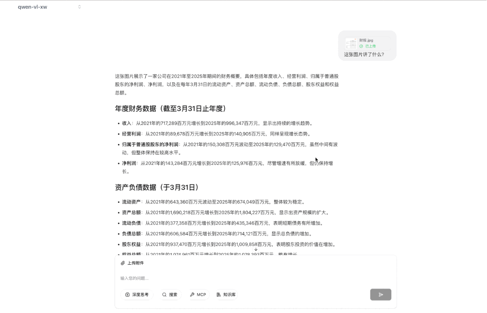

# PAI-RAG：开源Agentic RAG框架, 让智能检索像呼吸一样简单

> ✨ **无需ML专家，赋能LLM开发者5分钟构建企业级Agentic RAG应用**

_↑ 用[PAI-RAG]实现：上传财报数据图片 → 提问“这张图片讲了什么？” → 理解图片对财报进行解读分析_

## 🔥 什么是PAI-RAG？

PAI-RAG是基于阿里云PAI平台的创新性开源项目，旨在推动检索增强生成技术在企业级应用中的落地，特别针对复杂知识处理与答案生成的全链路难点提供解决方案。PAI-RAG融合了知识库管理、多模态问答与MCP代理，打造一款**支持图片理解+联网搜索+工具调用+任务规划**的开源Agentic RAG框架。

**❌ 为什么传统RAG让你头疼？**

- **知识库管理低效**：单文件上传、切片固定、无法按元数据过滤 → 检索准确率低
- **纯文本局限**：遇到图片/PPT就失效 → 90%企业文档无法利用
- **简单查询即崩溃**：复杂问题（如“对比竞品策略”）需人工拆解 → 代理能力缺失
- **信息过时**：依赖静态知识库 → 无法获取实时数据（如股价/新闻）

**✅ 为什么PAI-RAG是企业RAG落地的最佳选择？**

PAI-RAG不仅解决了传统RAG系统的固有局限，更通过Agentic能力将RAG从简单的问答系统升级为智能任务规划引擎。在企业实际应用场景中，PAI-RAG能够：

| 能力         | 传统RAG框架 | [PAI-RAG]              |
| ------------ | ----------- | ---------------------- |
| 知识库管理   | 单文件上传  | ✅ 并发上传+元数据过滤 |
| 多模态支持   | 仅文本      | ✅ 图片理解+图文回复   |
| 复杂任务处理 | 简单查询    | ✅ Agentic任务规划     |
| 实时信息获取 | 静态知识库  | ✅ 夸克联网搜索        |
| 工具扩展性   | 有限插件    | ✅ MCP深度集成         |
| 企业级能力   | 高定制成本  | ✅场景化部署 开箱即用  |

- 降低90%以上的文档处理门槛，让非技术用户也能高效管理知识库
- 通过多模态理解能力，释放企业沉淀的图片、PPT等非结构化数据价值
- 借助MCP代理框架，自动完成复杂任务规划与执行，大幅提升AI应用效能
- 无缝集成阿里云生态，提供企业级稳定性与可扩展性保障

作为开源项目，PAI-RAG持续迭代优化，致力于成为企业构建智能知识中枢的首选框架，让RAG技术真正赋能业务创新与决策升级。

---

## 🌟 核心特性：不止于RAG，更是智能任务规划引擎

1. **企业级知识库管理**
   - 高并发文档处理：支持多线程/异步文件上传，大幅提升企业级文档处理效率
   - 动态切片优化：提供可视化界面调整chunk size，适配不同业务场景需求
   - 精准元数据检索：基于标签、时间、来源等多维度过滤，显著提升检索准确率
2. **多模态内容理解能力**
   - 全面文档解析：集成OCR与实体识别等技术，解析图片、PPT等非文本内容
   - 图片理解：基于多模态大模型能力，自动识别图片内容
   - 图文混合生成：自动嵌入图像与文本，生成更丰富、直观的回答
3. **Agentic RAG：自主任务规划系统**
   - ReAct框架驱动：通过探索式搜索迭代优化查询（如"生成国庆去上海的旅游攻略"）
   - 复杂任务分解：自主拆解"对比2023年财报与行业趋势"等多步骤任务
   - MCP智能代理：预置思考规划、附件问答等工具，支持自定义工作流扩展
4. **实时数据接入能力**
   - 灵活配置联网搜索：支持使用阿里云通用搜索服务API接口，轻松访问实时数据
   - 自动RAG化处理：搜索结果无需手动清洗，直接融入知识库，获取更精准、全面的搜索结果
   - 多源数据整合：无缝连接企业内部数据与外部实时信息源

---

## ⚡ 快速开始

- [安装指南](docs/quick_start.md)
- [使用示例：多模态附件问答](docs/mm_demo.md)

## 🛠 深入使用

- [系统配置指南及API调用说明](docs/config.md)
- [知识库管理（上传文档+元数据过滤）](docs/knowledgebase.md)
- [多模态问答实战（支持知识库和附件上传）](docs/multimodal.md)
- [Agentic RAG任务演示（复杂查询规划与执行，支持联网搜索和MCP工具调用）](docs/agentic_rag.md)

## 💬 联系我们

- PAI-RAG官方钉钉群号：27370042974
  
