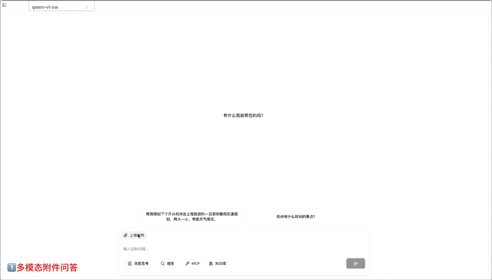

<div align="center">

# PAI-RAG

### 开源 Agentic RAG 框架，让智能检索像呼吸一样简单

[](https://github.com/aigc-apps/PAI-RAG)
[](LICENSE)
[](https://python.org)

**图片理解 | 联网搜索 | 工具调用 | 任务规划 | MCP 集成 | Text-to-SQL**

无需 ML 专家，5 分钟构建企业级 Agentic RAG 应用

[快速开始](#-快速开始) | [核心特性](#-核心特性) | [架构总览](#-架构总览) | [部署指南](#-部署指南) | [API 文档](#-api-文档) | [联系我们](#-联系我们)

</div>

---



## 为什么选择 PAI-RAG？

PAI-RAG 是基于阿里云 PAI 平台的开源 Agentic RAG 框架，专注于企业级复杂知识处理与智能问答场景。它不仅是一个 RAG 系统，更是一个融合了**知识库管理、多模态理解、ReAct 智能体、MCP 工具生态**的一站式解决方案。

| 能力 | 传统 RAG | PAI-RAG |
|:---:|:---:|:---:|
| 知识库管理 | 单文件上传，切片固定 | 并发上传 + 动态切片 + 元数据过滤 |
| 文档解析 | 仅文本 | 20+ 格式：PDF / Office / 图片 / 视频 |
| 检索策略 | 向量检索 | 向量 + 全文 + 混合检索 + Rerank |
| 多模态 | 不支持 | 图片理解 + 视频解析 + 图文混合回复 |
| 复杂任务 | 简单问答 | ReAct 智能体 + 任务规划 + 并行工具调用 |
| 实时信息 | 静态知识库 | 联网搜索（阿里云 IQS / Tavily） |
| 工具生态 | 有限插件 | MCP 深度集成（客户端 + 服务端） |
| 数据分析 | 不支持 | 代码沙箱 + Text-to-SQL |
| 企业能力 | 高定制成本 | 多租户 + RBAC + 可观测 + 开箱即用 |

---

## 核心特性

### 1. 企业级知识库管理

- **20+ 文档格式**：PDF、DOCX、PPTX、Excel、CSV、Markdown、HTML、JSONL、图片、视频等
- **智能切片策略**：句子级、Token 级、段落级、Markdown 感知、版面感知等多种策略，按知识库独立配置
- **三大检索模式**：向量检索、全文检索、混合检索（向量 + BM25），配合 Reranker 精排
- **元数据过滤**：支持标签、时间、来源等多维度复合条件过滤，最深 5 层嵌套
- **Chunk 级管理**：可视化查看、编辑、激活/停用单个知识片段
- **FAQ 模式**：Excel 直接导入为问答对，适配客服等场景
- **异步处理**：基于 Celery + Redis 的后台任务队列，大批量文件上传不阻塞

### 2. 多模态内容理解

- **文档图片自动提取**：从 PDF/DOCX/PPTX 中提取图片，通过多模态大模型生成描述并索引
- **图片问答**：直接上传图片到知识库或作为对话附件，AI 自动理解图片内容
- **视频解析**：支持 MP4/AVI/MOV 等视频格式，自动提取关键帧并生成描述
- **图文混合生成**：回答中自动嵌入相关图片，生成更丰富直观的结果

### 3. Agentic RAG 智能体

- **ReAct 框架**：思考-行动-观察循环，支持并行工具调用，最大 20 步推理
- **思维链支持**：原生支持 Qwen3、DeepSeek-R1 等思考模型，分离推理过程与最终回答
- **任务规划**：自动拆解复杂多步骤任务（如"对比 2023 年财报与行业趋势"）
- **流式输出**：SSE 实时推送，工具调用过程透明可见

### 4. MCP 生态集成

- **MCP 客户端**：接入任意外部 MCP 服务器（SSE/stdio），即时扩展工具能力
- **MCP 服务端**：将知识库检索暴露为 MCP 工具，供外部 AI Agent 调用
- **即插即用**：通过 Web UI 或 API 动态添加/移除 MCP 服务器

### 5. 丰富的内置工具

| 工具 | 说明 |
|---|---|
| 知识库检索 | 对配置的知识库进行 RAG 检索 |
| 联网搜索 | 阿里云 IQS / Tavily 实时搜索 |
| 网页浏览 | 访问并解析指定 URL 内容 |
| 代码沙箱 | 云端 Python 沙箱，支持数据分析和图表生成 |
| Text-to-SQL | 自然语言查询 MySQL/PostgreSQL 数据库 |
| 附件解析 | 读取分析上传的文件附件 |
| 思考推理 | 结构化的反思与推理 |
| 任务规划 | 复杂任务的分解与规划 |

### 6. 企业级能力

- **多租户架构**：所有资源按 tenant_id 隔离，适合 SaaS 多租户部署
- **RBAC 权限控制**：用户-角色-文档三级权限，精确到 Chunk 级别的访问控制
- **内容安全**：集成阿里云内容安全（Green），自动审查输入输出
- **可观测性**：OpenTelemetry 全链路追踪，支持 OTLP/HTTP 和 OTLP/gRPC
- **OpenAI 兼容 API**：`/v1/chat/completions` 标准接口，可直接对接现有应用

---

## 架构总览

```
┌──────────────────────────────────────────────────────────┐
│                    Web UI (Next.js)                       │
├──────────────────────────────────────────────────────────┤
│                  FastAPI Backend                          │
│  ┌─────────┐  ┌──────────┐  ┌──────────┐  ┌──────────┐  │
│  │Chat API │  │ RAG API  │  │Config API│  │ MCP API  │  │
│  │(OpenAI) │  │(Retrieval│  │(管理接口)│  │(工具服务)│  │
│  └────┬────┘  └────┬─────┘  └──────────┘  └──────────┘  │
│       │            │                                      │
│  ┌────▼────────────▼─────────────────────────────────┐   │
│  │              ReAct Agent Engine                     │   │
│  │  ┌────┐ ┌────┐ ┌────┐ ┌─────┐ ┌───┐ ┌──────────┐ │   │
│  │  │ KB │ │搜索│ │代码│ │T2SQL│ │MCP│ │附件/多模态│ │   │
│  │  └──┬─┘ └──┬─┘ └──┬─┘ └──┬──┘ └─┬─┘ └────┬─────┘ │   │
│  └─────┼──────┼──────┼─────┼─────┼────────┼─────────┘   │
├────────┼──────┼──────┼─────┼─────┼────────┼─────────────┤
│  ┌─────▼──┐ ┌─▼──┐ ┌▼───┐ ┌▼──┐ ┌▼────┐ ┌▼────────┐   │
│  │VectorDB│ │IQS/│ │云沙│ │DB │ │外部  │ │文件存储  │   │
│  │7种后端 │ │搜索│ │ 箱 │ │   │ │MCP  │ │Local/OSS│   │
│  └────────┘ └────┘ └────┘ └───┘ └─────┘ └─────────┘   │
└──────────────────────────────────────────────────────────┘
```

### 支持的向量数据库

| 后端 | 类型 | 向量检索 | 全文检索 | 混合检索 |
|---|---|:---:|:---:|:---:|
| Chroma (本地) | 嵌入式 | :white_check_mark: | :x: | :x: |
| Milvus | 云/自建 | :white_check_mark: | :white_check_mark: | :white_check_mark: |
| Elasticsearch | 云/自建 | :white_check_mark: | :white_check_mark: | :white_check_mark: |
| PostgreSQL (pgvector) | 云/自建 | :white_check_mark: | :white_check_mark: | :white_check_mark: |
| Hologres | 阿里云 | :white_check_mark: | :x: | :x: |
| OpenSearch | 阿里云 | :white_check_mark: | :x: | :x: |
| Tablestore | 阿里云 | :white_check_mark: | :x: | :x: |

### 支持的 LLM

通过 **OpenAI 兼容接口**，支持接入任意大语言模型：

- **通义千问（DashScope）**：Qwen-Max / Qwen-Plus / Qwen-Turbo / Qwen-VL 等
- **OpenAI**：GPT-4o / GPT-4 / GPT-3.5 等
- **开源自部署**：通过 vLLM / Ollama 等部署的任意模型
- **思考模型**：原生支持 Qwen3、DeepSeek-R1 等思维链模型

---

## 快速开始

### Docker 部署（推荐）

```bash
git clone https://github.com/aigc-apps/PAI-RAG.git
cd PAI-RAG/docker
cp .env.example .env
# 编辑 .env 配置你的参数
docker compose up -d
```

启动后访问 http://localhost:8680 即可使用。

### 本地开发

```bash
# 创建 Python 3.11 环境
conda create -n pai-rag python=3.11 && conda activate pai-rag

# 安装依赖
pip install poetry && poetry install

# 配置环境变量
cp .env.example .env

# 启动服务（需要先启动 Redis）
./scripts/start.sh --dev
```

### 阿里云 EAS 部署

参考 [EAS 部署指南](docs/deploy/eas_deploy.md)，一键部署到阿里云 PAI-EAS。

---

## 环境变量配置

| 变量 | 说明 | 默认值 |
|---|---|---|
| `DB_TYPE` | 元数据库类型：`sqlite` / `postgresql` / `mysql` | `sqlite` |
| `FILE_STORE_TYPE` | 文件存储：`local` / `oss` | `local` |
| `VECTOR_DB_TYPE` | 向量库：`local` / `milvus` / `elasticsearch` / `postgresql` / `hologres` / `opensearch` / `tablestore` | `local` |
| `REDIS_HOST` | Redis 地址 | `localhost` |
| `USE_CUDA` | 是否启用 GPU 加速 | `false` |
| `MAX_RECURSION_STEPS` | Agent 最大推理步数 | `20` |
| `ENABLE_MINERU` | 启用 MinerU 高级 PDF 解析 | `false` |

完整配置请参考 [环境变量文档](docs/env.md)。

---

## API 文档

PAI-RAG 提供 OpenAI 兼容的标准 API：

```bash
# Chat Completions（流式）
curl http://localhost:8682/v1/chat/completions \
  -H "Content-Type: application/json" \
  -d '{
    "model": "your-model",
    "messages": [{"role": "user", "content": "你好"}],
    "stream": true
  }'
```

| 接口 | 说明 | 文档 |
|---|---|---|
| `POST /v1/chat/completions` | 对话补全（OpenAI 兼容） | [Chat API](docs/api/chat.md) |
| `POST /v1/retrieval` | 知识库检索（Dify 兼容） | [Retrieval API](docs/api/knowledgebase_management.md) |
| `POST /v1/embeddings` | 文本向量化 | - |
| `GET/POST /v1/knowledgebases` | 知识库管理 | [KB API](docs/api/kb_file_management.md) |
| `POST /v1/mcp/*` | MCP 工具服务 | - |

---

## 深入使用

### 项目部署
- [快速部署到 EAS](docs/deploy/eas_deploy.md)
- [Docker 镜像构建](docs/build/docker_build.md)
- [GPU 环境部署](docs/build/run_on_gpu.md)
- [Redis 配置指南](docs/redis_config.md)

### 模型配置
- [LLM 配置指南](docs/api/config/llm.md)
- [Embedding 配置指南](docs/api/config/embedding.md)

### 功能指南
- [Agentic RAG 使用指南](docs/agentic_rag.md)（任务规划 / 联网搜索 / MCP 工具调用）
- [多模态问答](docs/multimodal.md)（知识库图片理解 + 附件上传）
- [多模态附件示例](docs/mm_demo.md)
- [代码沙箱](docs/code_sandbox.md)（数据分析 / 图表生成）
- [权限控制](docs/access_control.md)（RBAC 文档级权限）

### API 参考
- [Chat API](docs/api/chat.md)
- [知识库管理 API](docs/api/knowledgebase_management.md)
- [知识库文件管理 API](docs/api/kb_file_management.md)

---

## 项目结构

```
PAI-RAG/
├── backend/                 # FastAPI 后端
│   ├── api/v1/              # REST API 路由
│   ├── agent/               # ReAct 智能体引擎
│   ├── tools/               # 内置工具（检索/搜索/代码/SQL/附件等）
│   ├── rag/                 # RAG 管线（切片/向量化/重排序）
│   ├── common/              # 通用组件（LLM 客户端/向量库连接器）
│   ├── service/             # 业务逻辑层
│   ├── evaluation/          # RAG 评估框架
│   └── extensions/          # 扩展（内容安全/链路追踪）
├── frontend/                # Next.js Web UI
├── integrations/
│   └── pairag-file/         # 文件解析库（20+ 格式）
├── docker/                  # Docker Compose 部署
├── docs/                    # 文档
└── alembic/                 # 数据库迁移
```

---

## 联系我们

PAI-RAG 官方钉钉群号：**27370042974**


