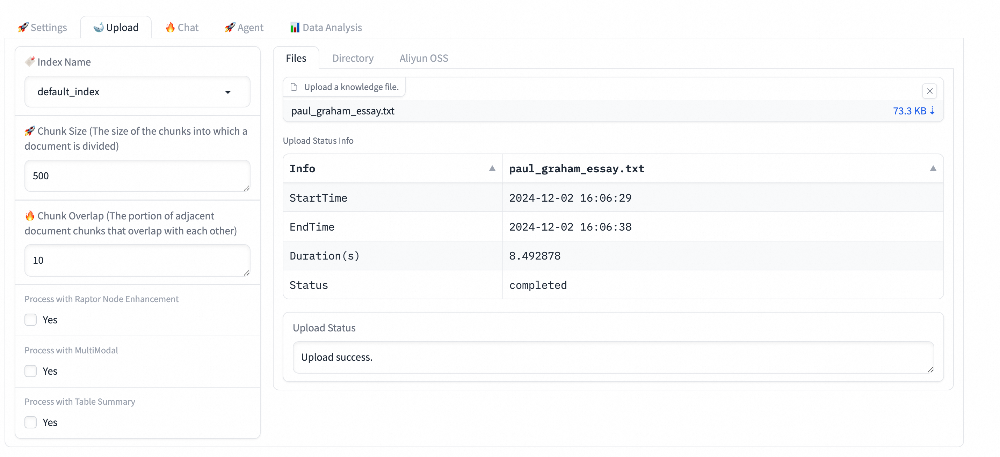
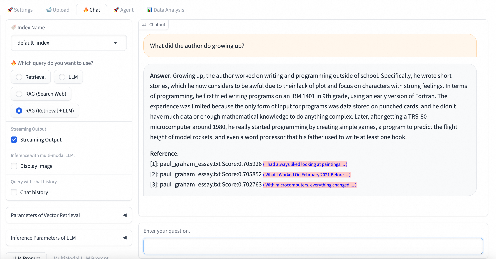

<p align="center">
    <h1>PAI-RAG: 一个易于使用的模块化RAG框架 </h1>
</p>

[](https://github.com/aigc-apps/PAI-RAG/actions/workflows/main.yml)

<details open>
<summary></b>📕 目录</b></summary>

- 💡 [什么是PAI-RAG?](#-什么是pai-rag)
- 🌟 [主要模块和功能](#-主要模块和功能)
- 🔎 [快速开始](#-快速开始)
  - [Docker镜像](#Docker镜像启动)
  - [本地环境](#本地启动)
- 📜 [文档](#-文档)
  - [API服务](#api服务)
  - [Agentic RAG](#agentic-rag)
  - [数据分析Nl2sql](#数据分析-nl2sql)
  - [支持文件类型](#支持文件类型)

</details>

# 💡 什么是PAI-RAG?

PAI-RAG 是一个易于使用的模块化 RAG（检索增强生成）开源框架，结合 LLM（大型语言模型）提供真实问答能力，支持 RAG 系统各模块灵活配置和定制开发，为基于阿里云人工智能平台（PAI）的任何规模的企业提供生产级的 RAG 系统。

# 🌟 主要模块和功能

- 模块化设计，灵活可配置
- 功能丰富，包括Agentic RAG, 多模态问答和nl2sql等
- 基于社区开源组件构建，定制化门槛低
- 多维度自动评估体系，轻松掌握各模块性能质量
- 集成全链路可观测和评估可视化工具
- 交互式UI/API调用，便捷的迭代调优体验
- 阿里云快速场景化部署/镜像自定义部署/开源私有化部署

# 🔎 快速开始

## Docker镜像启动

您可以通过两种方式在本地运行 PAI-RAG：Docker 环境或直接从源代码运行。

1. 设置环境变量

   ```bash
   git clone git@github.com:aigc-apps/PAI-RAG.git
   cd PAI-RAG/docker
   cp .env.example .env
   ```

   如果您需要使用通义千问API或者阿里云OSS存储，请编辑 .env 文件。
   其中DASHSCOPE_API_KEY获取地址为 https://dashscope.console.aliyun.com/apiKey。
   当服务启动后您依然可以在WEB UI中配置这些API_KEY信息，但是我们建议您通过环境变量的方式配置。

2. 使用`docker compose`命令启动服务：

   ```bash
   docker-compose up -d
   ```

3. 打开浏览器中的 http://localhost:8000 访问web ui. 第一次启动服务会下载需要的相关模型文件，需要等待20分钟左右。

## 本地启动

如果想在本地启动或者进行代码开发，可以参考文档：[本地开发指南](./docs/develop/local_develop_zh.md)

## 通过Web UI查询的示例

1. 打开 http://localhost:8000 在浏览器中。根据需要调整索引和LLM设置。

   

2. 访问"上传"页面，上传测试数据：./example_data/paul_graham/paul_graham_essay.txt。

   

3. 切换到"聊天"页面, 进行对话。

   

## 通过API接口查询的示例

1. 打开 http://localhost:8000 在浏览器中。根据需要调整索引和LLM设置。

2. 使用API上传数据：

   切换到`PAI-RAG`目录

   ```shell
   cd PAI-RAG
   ```

   **请求**

   ```shell
   curl -X 'POST' http://localhost:8000/api/v1/upload_data \
   -H 'Content-Type: multipart/form-data' \
      -F 'files=@example_data/paul_graham/paul_graham_essay.txt'
   ```

   **响应**

   ```json
   {
     "task_id": "1bcea36a1db740d28194df8af40c7226"
   }
   ```

3. 检查上传任务的状态：

   **请求**

   ```shell
   curl http://localhost:8000/api/v1/get_upload_state\?task_id\=1bcea36a1db740d28194df8af40c7226
   ```

   **响应**

   ```json
   {
     "task_id": "1bcea36a1db740d28194df8af40c7226",
     "status": "completed",
     "detail": null
   }
   ```

4. Perform a RAG query:

   **请求**

   ```shell
   curl -X 'POST' http://localhost:8000/api/v1/query \
      -H "Content-Type: application/json" \
      -d '{"question":"What did the author do growing up?"}'
   ```

   **响应**

   ```json
   {
      "answer":"Growing up, the author worked on writing and programming outside of school. Specifically, he wrote short stories, which he now considers to be awful due to their lack of plot and focus on characters with strong feelings. In terms of programming, he first tried writing programs on an IBM 1401 in 9th grade, using an early version of Fortran. The experience was limited because the only form of input for programs was data stored on punched cards, and he didn't have much data to work with. Later, after getting a TRS-80 microcomputer around 1980, he really started programming by creating simple games, a program to predict the flight height of model rockets, and even a word processor that his father used to write at least one book.",
      "session_id":"ba245d630f4d44a295514345a05c24a3",
      "docs":[
         ...
      ]
   }
   ```

# 📜 文档

## API服务

可以直接通过API服务调用RAG能力（上传数据，RAG查询，检索，NL2SQL, Function call等等）。更多细节可以查看[API文档](./docs/api_zh.md)

## Agentic RAG

您也可以在PAI-RAG中使用支持API function calling功能的Agent，请参考文档：
[Agentic RAG](./docs/agentic_rag.md)

## 数据分析 NL2sql

您可以在PAI-RAG中使用支持数据库和表格文件的数据分析功能，请参考文档：[数据分析 Nl2sql](./docs/data_analysis_doc.md)

## 支持文件类型

| 文件类型 | 文件格式                               |
| -------- | -------------------------------------- |
| 非结构化 | .txt, .docx， .pdf， .html，.pptx，.md |
| 图片     | .gif， .jpg，.png，.jpeg， .webp       |
| 结构化   | .csv，.xls， .xlsx，.jsonl             |
| 其他     | .epub，.mbox，.ipynb                   |

1. .doc格式文档需转化为.docx格式
2. .ppt和.pptm格式需转化为.pptx格式
