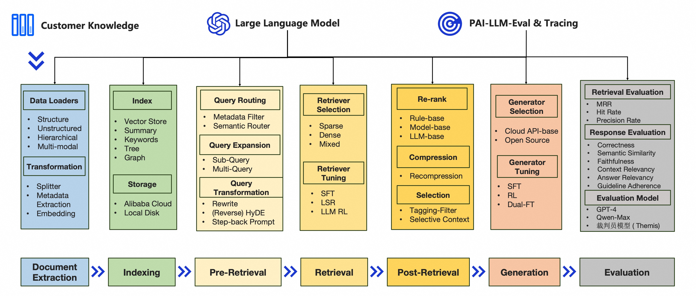

<p align="center">
    <h1>PAI-RAG: 一个易于使用的模块化RAG框架 </h1>
</p>

[](https://github.com/aigc-apps/PAI-RAG/actions/workflows/main.yml)

<details open>
<summary></b>📕 目录</b></summary>

- 💡 [什么是PAI-RAG?](#什么是pai-rag)
- 🌟 [主要模块和功能](#主要模块和功能)
- 🔎 [快速开始](#快速开始)
  - [本地环境](#方式一本地环境)
  - [Docker镜像](#方式二docker镜像)
- 🔧 [API服务](#api服务)

</details>

# 💡 什么是PAI-RAG?

PAI-RAG 是一个易于使用的模块化 RAG（检索增强生成）开源框架，结合 LLM（大型语言模型）提供真实问答能力，支持 RAG 系统各模块灵活配置和定制开发，为基于阿里云人工智能平台（PAI）的任何规模的企业提供生产级的 RAG 系统。

# 🌟 主要模块和功能



- 模块化设计，灵活可配置
- 基于社区开源组件构建，定制化门槛低
- 多维度自动评估体系，轻松掌握各模块性能质量
- 集成全链路可观测和评估可视化工具
- 交互式UI/API调用，便捷的迭代调优体验
- 阿里云快速场景化部署/镜像自定义部署/开源私有化部署

# 🔎 快速开始

## 方式一：本地环境

1. 克隆仓库

   ```bash
   git clone git@github.com:aigc-apps/PAI-RAG.git
   ```

2. 配置开发环境

   本项目使用poetry进行管理，若在本地环境下使用，建议在安装环境之前先创建一个空环境。为了确保环境一致性并避免因Python版本差异造成的问题，我们指定Python版本为3.10。

   ```bash
   conda create -n rag_env python==3.10
   conda activate rag_env
   ```

- (1) CPU环境

  直接使用poetry安装项目依赖包：

  ```bash
  pip install poetry
  poetry install
  ```

- (2) GPU环境

  首先替换默认 pyproject.toml 为 GPU 版本, 再使用poetry安装项目依赖包：

  ```bash
  mv pyproject_gpu.toml pyproject.toml && rm poetry.lock
  pip install poetry
  poetry install
  ```

- 常见网络超时问题

  注：在安装过程中，若遇到网络连接超时的情况，可以添加阿里云或清华的镜像源，在 pyproject.toml 文件末尾追加以下几行：

  ```bash
  [[tool.poetry.source]]
  name = "mirrors"
  url = "http://mirrors.aliyun.com/pypi/simple/" # 阿里云
  # url = "https://pypi.tuna.tsinghua.edu.cn/simple/" # 清华
  priority = "default"
  ```

  之后，再依次执行以下命令：

  ```bash
  poetry lock
  poetry install
  ```

3. 加载数据

   向当前索引存储中插入data_path路径下的新文件

   ```bash
   load_data -c src/pai_rag/config/settings.yaml -d data_path -p pattern
   ```

   path examples:

   ```
   a. load_data -d test/example
   b. load_data -d test/example_data/pai_document.pdf
   c. load_data -d test/example_data -p *.pdf

   ```

4. 启动RAG服务

   使用OpenAI API，需要在命令行引入环境变量

   ```bash
   export OPENAI_API_KEY=""
   ```

   使用DashScope API，需要在命令行引入环境变量

   ```bash
   export DASHSCOPE_API_KEY=""
   ```

   ```bash
   # 启动，支持自定义host(默认0.0.0.0), port(默认8001), config(默认src/pai_rag/config/settings.yaml), enable-example(默认True), skip-download-models(不加为False)
   # 默认启动时下载模型 [bge-small-zh-v1.5, easyocr] , 可设置 skip-download-models 避免启动时下载模型.
   # 可使用命令行 "load_model" 下载模型 including [bge-small-zh-v1.5, easyocr, SGPT-125M-weightedmean-nli-bitfit, bge-large-zh-v1.5, bge-m3, bge-reranker-base, bge-reranker-large, paraphrase-multilingual-MiniLM-L12-v2, qwen_1.8b, text2vec-large-chinese]
   pai_rag serve [--host HOST] [--port PORT] [--config CONFIG_FILE] [--enable-example False] [--skip-download-models]
   ```

5. 下载其他模型到本地

   ```bash
   # 支持 model name (默认 ""), 没有参数时, 默认下载上述所有模型。
   load_model [--model-name MODEL_NAME]
   ```

6. 启动RAG WebUI

   ```bash
   # 启动，支持自定义host(默认0.0.0.0), port(默认8002), config(默认localhost:8001)
   pai_rag ui [--host HOST] [--port PORT] [rag-url RAG_URL]
   ```

   你也可以打开http://127.0.0.1:8002/ 来配置RAG服务以及上传本地数据。

7. 评估 (调试)

您可以评估RAG系统的不同阶段的效果，如检索、生成或者全链路。

```bash
# 支持自定义 config file (default -c src/pai_rag/config/settings.yaml), overwrite (default False), type (default all)
evaluation [-c src/pai_rag/config/settings.yaml] [-o False] [-t retrieval]
```

## 方式二：Docker镜像

为了更方便使用，节省较长时间的环境安装问题，我们也提供了直接基于镜像启动的方式。

### 使用公开镜像

1. 启动RAG服务

- CPU

  ```bash
  docker pull mybigpai-public-registry.cn-beijing.cr.aliyuncs.com/mybigpai/pairag:0.0.2

  # 启动: -p(端口) -v(挂载embedding和rerank模型目录) -e(设置环境变量，若使用Dashscope LLM/Embedding，需要引入) -w(worker数量，可以指定为近似cpu核数)
  docker run -p 8001:8001 -v /huggingface:/huggingface -e DASHSCOPE_API_KEY=sk-xxxx -d mybigpai-public-registry.cn-beijing.cr.aliyuncs.com/mybigpai/pairag:0.0.2 gunicorn -b 0.0.0.0:8001 -w 16 -k uvicorn.workers.UvicornH11Worker pai_rag.main:app
  ```

- GPU

  ```bash
  docker pull mybigpai-public-registry.cn-beijing.cr.aliyuncs.com/mybigpai/pairag:0.0.2_gpu

  # 启动: -p(端口) -v(挂载embedding和rerank模型目录) -e(设置环境变量，若使用Dashscope LLM/Embedding，需要引入) -w(worker数量，可以指定为近似cpu核数)
  docker run -p 8001:8001 -v /huggingface:/huggingface --gpus all -e DASHSCOPE_API_KEY=sk-xxxx -d mybigpai-public-registry.cn-beijing.cr.aliyuncs.com/mybigpai/pairag:0.0.2_gpu gunicorn -b 0.0.0.0:8001 -w 16 -k uvicorn.workers.UvicornH11Worker pai_rag.main:app
  ```

2. 启动RAG WebUI
   
- Linux:

   ```bash
   docker pull mybigpai-public-registry.cn-beijing.cr.aliyuncs.com/mybigpai/pairag:0.0.2_ui

   docker run --network host -d mybigpai-public-registry.cn-beijing.cr.aliyuncs.com/mybigpai/pairag:0.0.2_ui
   ```

- Mac/Windows:

   ```bash
   docker pull mybigpai-public-registry.cn-beijing.cr.aliyuncs.com/mybigpai/pairag:0.0.2_ui

   docker run -p 8002:8002 -d mybigpai-public-registry.cn-beijing.cr.aliyuncs.com/mybigpai/pairag:0.0.2_ui pai_rag ui -p 8002 -c http://host.docker.internal:8001/
   ```
- Tips:
  低版本的docker(<=20.10.7)
  - 需要添加参数```--security-opt seccomp:unconfined```这是因为numpy在低版本会报Operation not permitted的错误
  - 将```-c http://host.docker.internal:8001/```改为```-c http://172.17.0.1:8001/```这是因为低版本docker不支持```host.docker.internal```访问宿主机ip

### 基于Dockerfile自行构建镜像

可以参考[How to Build Docker](docs/docker_build.md)来自行构建镜像。

镜像构建完成后可参考【使用公开镜像】的步骤启动RAG服务和WebUI。

# 🔧 API服务

你可以使用命令行向服务侧发送API请求。比如调用[Upload API](#upload-api)上传知识库文件。

## Upload API

支持通过API的方式上传本地文件，并支持指定不同的faiss_path，每次发送API请求会返回一个task_id，之后可以通过task_id来查看文件上传状态（processing、completed、failed）。

- 上传（upload_data）

```bash
curl -X 'POST' http://127.0.0.1:8000/service/upload_data -H 'Content-Type: multipart/form-data' -F 'files=@local_path/PAI.txt' -F 'faiss_path=localdata/storage'

# Return: {"task_id": "2c1e557733764fdb9fefa063538914da"}
```

- 查看上传状态（get_upload_state）

```bash
curl http://127.0.0.1:8077/service/get_upload_state\?task_id\=2c1e557733764fdb9fefa063538914da

# Return: {"task_id":"2c1e557733764fdb9fefa063538914da","status":"completed"}
```

## Query API

- Rag Query请求

```bash
curl -X 'POST' http://127.0.0.1:8000/service/query -H "Content-Type: application/json" -d '{"question":"PAI是什么？"}'
```

- 多轮对话请求

```bash
curl -X 'POST' http://127.0.0.1:8000/service/query -H "Content-Type: application/json" -d '{"question":"PAI是什么？"}'

# 传入session_id：对话历史会话唯一标识，传入session_id后，将对话历史进行记录，调用大模型将自动携带存储的对话历史。
curl -X 'POST' http://127.0.0.1:8000/service/query -H "Content-Type: application/json" -d '{"question":"它有什么优势？", "session_id": "1702ffxxad3xxx6fxxx97daf7c"}'

# 传入chat_history：用户与模型的对话历史，list中的每个元素是形式为{"user":"用户输入","bot":"模型输出"}的一轮对话，多轮对话按时间顺序排列。
curl -X 'POST' http://127.0.0.1:8000/service/query -H "Content-Type: application/json" -d '{"question":"它有哪些功能？", "chat_history": [{"user":"PAI是什么？", "bot":"PAI是阿里云的人工智能平台，它提供一站式的机器学习解决方案。这个平台支持各种机器学习任务，包括有监督学习、无监督学习和增强学习，适用于营销、金融、社交网络等多个场景。"}]}'

# 同时传入session_id和chat_history：会用chat_history对存储的session_id所对应的对话历史进行追加更新
curl -X 'POST' http://127.0.0.1:8000/service/query -H "Content-Type: application/json" -d '{"question":"它有什么优势？", "chat_history": [{"user":"PAI是什么？", "bot":"PAI是阿里云的人工智能平台，它提供一站式的机器学习解决方案。这个平台支持各种机器学习任务，包括有监督学习、无监督学习和增强学习，适用于营销、金融、社交网络等多个场景。"}], "session_id": "1702ffxxad3xxx6fxxx97daf7c"}'
```

- Agent及调用Function Tool的简单对话

```bash
curl -X 'POST' http://127.0.0.1:8000/service/query/agent -H "Content-Type: application/json" -d '{"question":"今年是2024年，10年前是哪一年？"}'
```

## Evaluation API

支持三种评估模式：全链路评估、检索效果评估、生成效果评估。

- /evaluate (all)
- /evaluate/retrieval
- /evaluate/response

初次调用时会在 localdata/evaluation 下自动生成一个评估数据集（qc_dataset.json， 其中包含了由LLM生成的query、reference_contexts、reference_node_id、reference_answer）。同时评估过程中涉及大量的LLM调用，因此会耗时较久。

您也可以单独调用API（/evaluate/generate）来生成评估数据集。

参考示例：

```bash
curl -X 'POST' http://127.0.0.1:8000/service/evaluate/generate

curl -X 'POST' http://127.0.0.1:8000/service/evaluate
curl -X 'POST' http://127.0.0.1:8000/service/evaluate/retrieval
curl -X 'POST' http://127.0.0.1:8000/service/evaluate/response
```

# Function Calling

您也可以在PAI-RAG中使用function calling功能，请参考文档：

[Function Calling 使用说明](./docs/function_calling/readme.md)

# 参数配置

如需实现更多个性化配置，请参考文档：

[参数配置说明](./docs/config_guide_cn.md)
