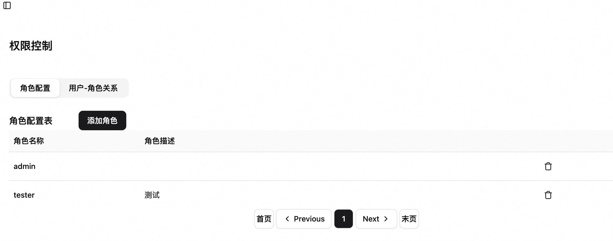
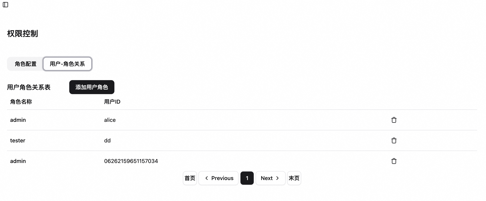
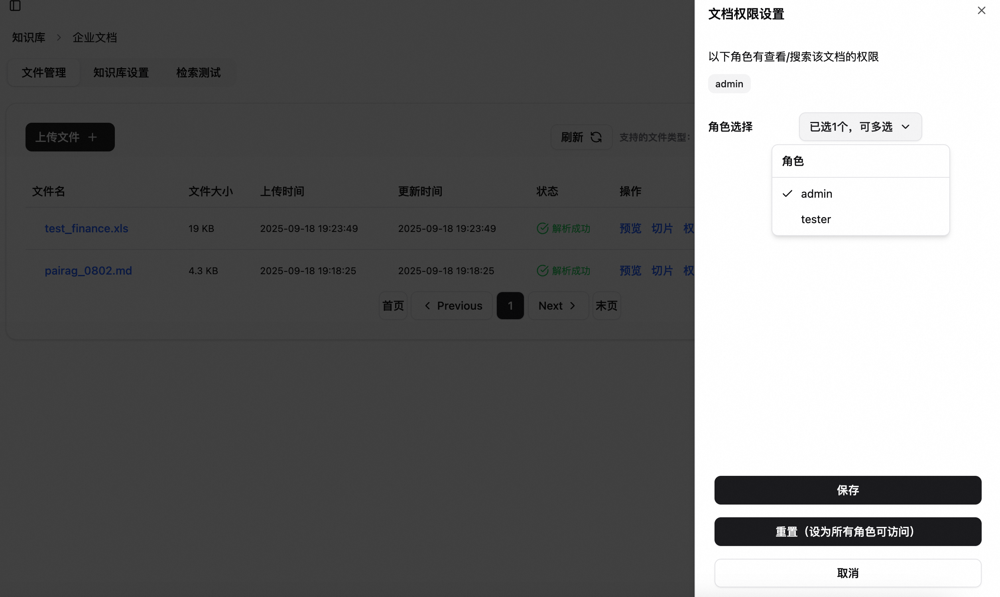
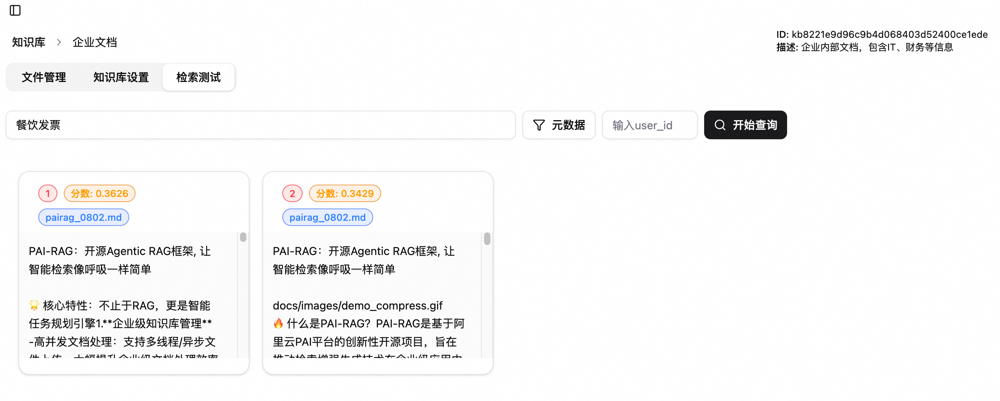
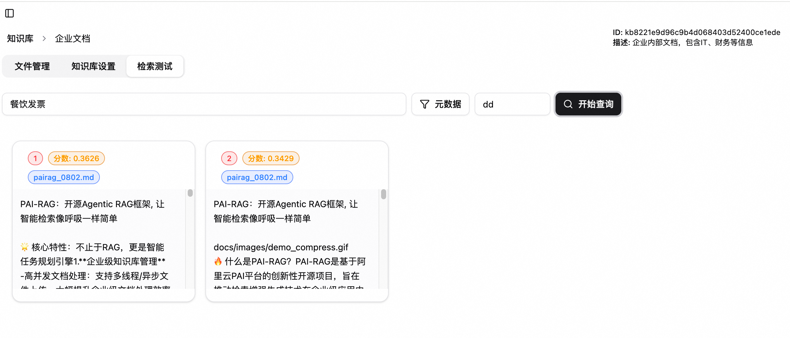
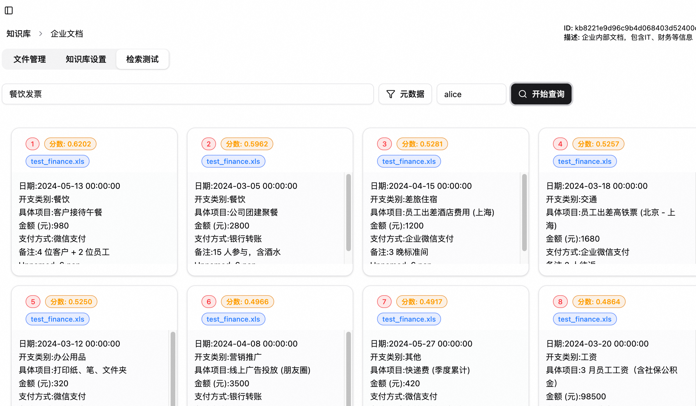
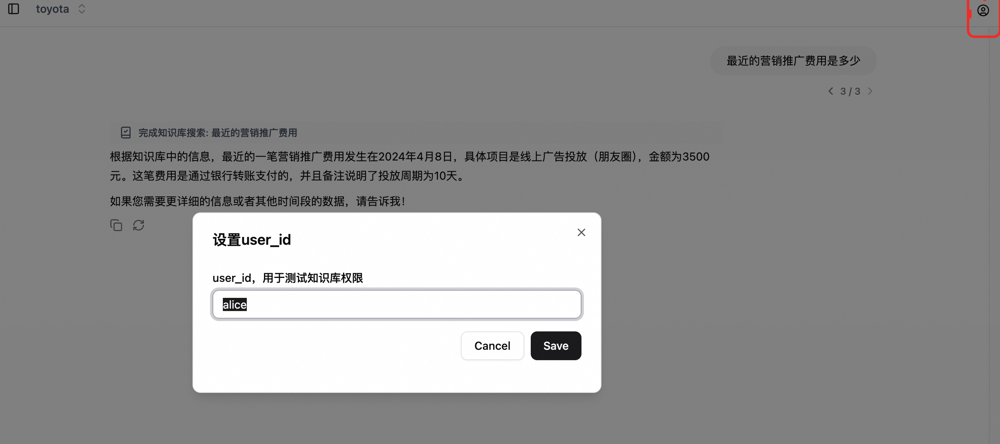
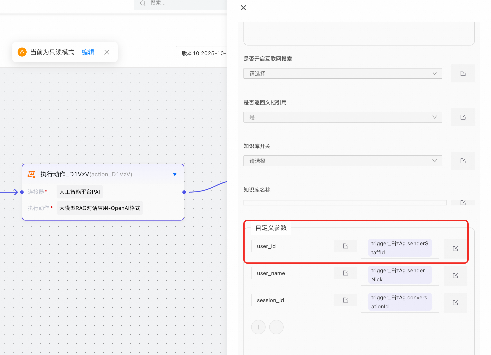

## 知识库文档权限控制
在企业知识库使用过程中，经常会面临对知识库文档进行访问控制的问题。
这里我们实现了一个基于角色的访问控制方法。
可以通过设置用户 - 角色 - 文档 的关系，来控制用户对文档的访问权限。

> 备注：本文档中数据均为虚构的测试数据。

### 权限设置方法

1. 创建自定义角色
自定义角色可以根据需求配置，如按照部门角色（admin, user, guest)、项目角色（pm, dev, editor, test)。
设置路径：页面左下角 设置 - 权限控制

2. 创建用户角色对应关系
根据用户id，可以分配对应的角色，如

设置路径：页面左下角 设置 - 权限控制

3. 设置文档可访问角色
默认每个文档没有设置可访问角色，表示可公开访问。
当设置对应角色后，可访问权限会变成只有指定角色的用户可以访问。
一个文档可以设置多个角色。

设置路径: 知识库 - 文档列表 - 权限

### 权限测试方法
#### 1. 知识库检索测试
未指定user_id时，搜索结果中不会包含设置权限的文档:

指定无权限user_id时，搜索结果中不会包含设置权限的文档:

使用有权限user_id搜索时，搜索结果中会包含设置权限的文档:

#### 2. 问答测试
点击对话页面右上角的用户配置，输入对应的user_id,即可测试不同用户对话的权限情况。

#### 3. 钉钉机器人连通
钉钉机器人连通，需要在钉钉连接器中传入对话的user_id信息，需在AppFlow的PAI连接器中设置传入user_id信息，这样会根据用户的企业工号id来做权限控制。

注意，这个字段需要在机器人发布之后生效。

