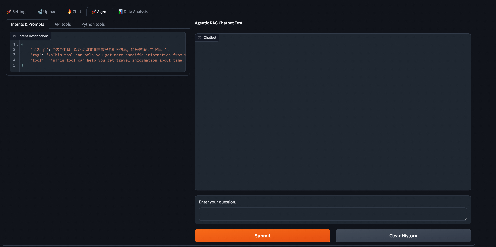
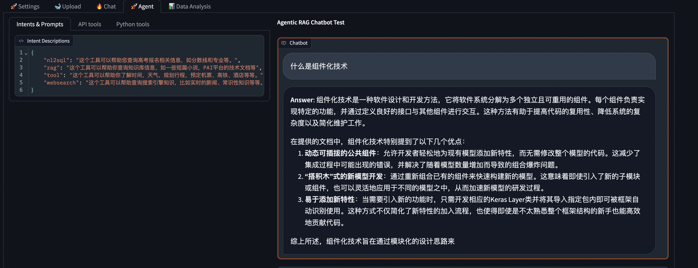
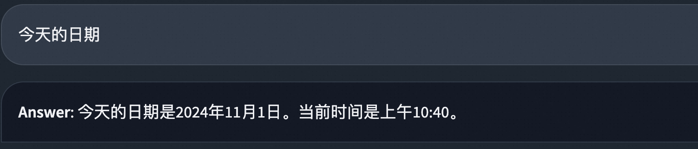
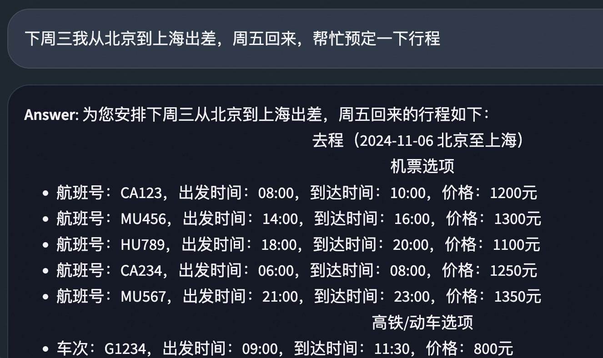
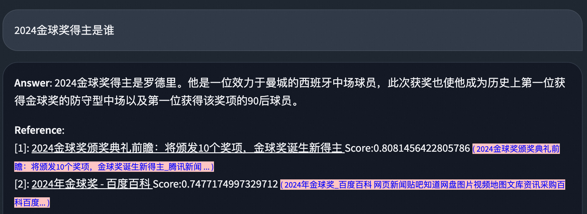
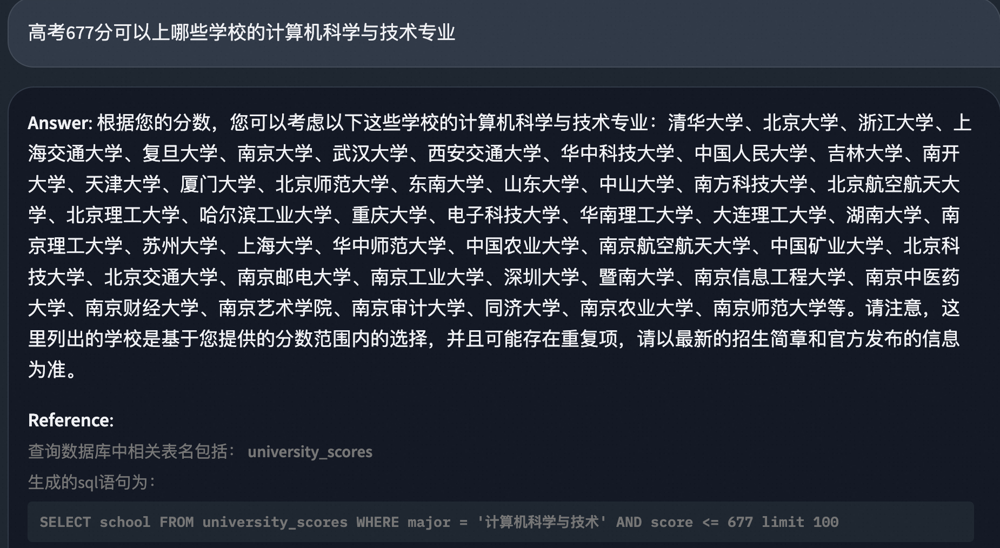

# Agentic RAG

RAG提供了非常好的知识库查询能力，然而在现实场景中问答的需求是多样化的，我们支持Agentic RAG，即在RAG的基础上，通过Agent的任务规划与工具能力，以完成更复杂的问答任务。
这里我们以一个简单的问答任务为例，展示如何使用Agentic RAG。
如下图所示，我们的Agent配置包含两部分，配置意图和工具（包含API工具/Python code工具）。



## 配置意图

系统内置实现了四种意图:

- rag: 默认的RAG，通过检索知识库生成回答。
- tool: 通过配置的工具，调用外部API/代码，生成回答。
- websearch: 通过集成的Bing搜索API，搜索互联网知识生成回答。
- nl2sql: 通过NL2SQL工具，将自然语言问题转化为SQL语句，查询数据库生成回答。

示例配置如下，可以根据自己需求，详细描述每个意图支撑的场景。

```json
{
  "nl2sql": "这个工具可以帮助您查询高考报名相关信息，如分数线和专业等。",
  "rag": "这个工具可以帮助你查询知识库信息，如一些短篇小说，PAI平台的技术文档等",
  "websearch": "这个工具可以帮助查询搜索引擎知识，比如实时的新闻、常识性知识等等。",
  "tool": "这个工具可以帮助你了解时间，天气，规划行程，预定机票、高铁、酒店等等。"
}
```

## 配置工具

目前我们支持以下两种工具的配置:

- API tools: 通过配置API工具，调用外部API结果并生成回答。
- Python tools: 通过配置python代码工具，直接调用python代码，基于调用结果生成回答。

系统启动时默认配置了demo用的订购酒店、高铁、飞机票的API工具，以及一个python代码工具，用于查询天气，可以根据需要换成自己配置的工具。

### 工具调用的System Prompt

除了工具本身描述之外，可以配置工具调用的System Prompt，用于指导模型在调用工具时，如何使用工具。
示例如下

```text
你是一个旅游小助手，可以帮助用户查询当前的时间信息，天气信息，指定时间从A地区到B地区的机票信息，火车票信息，酒店信息等。

如果客户问了明天或者下周等相对的时间，请用当前时间进行转换成YYYY-MM-DD格式，如2024-10-01。

请注意参数的中英文格式，严格使用输入的工具，不要虚构任何细节。
```

### API工具配置

可以配置一组api，格式如下:

```json
[
  {
    "description": "帮助用户获取机票信息，用户需要输入出发地、目的地",
    "headers": {
      "Authorization": "Bearer YOUR_ACCESS_TOKEN"
    },
    "method": "GET",
    "name": "search_flight_ticket_api",
    "parameters": {
      "date": {
        "description": "出发时间，YYYY-MM-DD格式，如'2024-03-29'",
        "type": "str"
      },
      "from_city": {
        "description": "出发城市，如'北京'、'上海'、'南京''",
        "type": "str"
      },
      "to_city": {
        "description": "目的地城市，如'北京'、'上海'、'南京'",
        "type": "str"
      }
    },
    "required": ["from_city", "to_city", "date"],
    "url": "http://127.0.0.1:8001/demo/api/flights"
  },
  {
    "content_type": "application/json",
    "description": "帮助用户查询酒店信息",
    "headers": {
      "Authorization": "Bearer YOUR_ACCESS_TOKEN"
    },
    "method": "POST",
    "name": "search_hotels_api",
    "parameters": {
      "checkin_date": {
        "description": "入住时间，YYYY-MM-DD格式，如'2024-03-29'",
        "type": "str"
      },
      "checkout_date": {
        "description": "离店时间，YYYY-MM-DD格式，如'2024-03-31'",
        "type": "str"
      },
      "city": {
        "description": "查询的城市，如'北京'、'上海'、'南京''",
        "type": "str"
      }
    },
    "required": ["city", "checkin_date", "checkout_date"],
    "url": "http://127.0.0.1:8001/demo/api/hotels"
  }
]
```

### Python代码工具配置

当API调用比较复杂（流式API, 文件上传等等）、或者直接调用API无法满足需求时，可以配置python代码工具。

Python代码工具分为两个部分:代码和函数定义。
这里我们提供一个天气查询的python代码示例（仅作为示例，亦可以用api工具实现）:

**函数定义代码**

```python
import requests
import os
from loguru import logger


def get_place_weather(city: str) -> str:
    logger.info(f"[Agent] Checking realtime weather info for {city}")

    """Get city name and return city weather"""
    api_key = os.environ.get("weather_api_key")

    # 可以直接赋值给api_key,原始代码的config只有type类型。
    base_url = "http://api.openweathermap.org/data/2.5/forecast?"
    complete_url = (
        f"{base_url}q={city}&appid={api_key}&lang=zh_cn&units=metric"
    )
    logger.info(f"Requesting {complete_url}...")
    response = requests.get(complete_url, timeout=5)
    weather_data = response.json()

    if weather_data["cod"] != "200":
        logger.error(
            f"获取天气信息失败，错误代码：{weather_data['cod']} 错误信息：{weather_data['message']}"
        )
        return f"获取天气信息失败，错误代码：{weather_data['cod']} 错误信息：{weather_data['message']}"

    element = weather_data["list"][0]

    return f"""
        {city}的天气:
        时间: {element['dt_txt']}
        温度: {element['main']['temp']} °C
        天气描述: {element['weather'][0]['description']}
    """
```

**函数定义**

```json
[
  {
    "function": {
      "description": "帮助用户查询实时天气信息，用户需要输入所在的城市英文名称，如hangzhou, beijing, shanghai, hongkong等等。",
      "name": "get_place_weather",
      "parameters": {
        "properties": {
          "city": {
            "description": "城市名称",
            "type": "string"
          }
        },
        "type": "object"
      }
    },
    "type": "function"
  }
]
```

## Chat窗口调用Agentic RAG

### RAG - 知识库问答

输入问题："什么是组件化技术"



### 使用工具 - 查询时间（内置工具）

输入问题："今天的日期"



### 使用工具 - 查询天气

输入问题："杭州的天气"


### 使用工具 - 行程预定

输入问题："我下周三从北京出发去上海出差，周五回来，帮忙安排一下行程"



### 使用工具 - AI搜索

输入问题："2024金球奖得主是谁"



### 使用工具 - NL2SQL

输入问题："高考677分可以上哪些学校的计算机科学与技术专业"



## API调用Agentic RAG

Agentic RAG支持通过API调用的方式，以支持更多复杂的业务场景。仅仅需要增加一个with_intent参数，就可以支持配置的意图识别+工具调用能力。

### RAG - 知识库问答

```sh
curl -X POST http://localhost:8001/service/query \
-H "Authorization: YOUR_TOKEN" \
-H "Content-Type: application/json" \
-d '{"question": "什么是组件化技术", "with_intent": true, "stream": true}'
```

**Response**

```
data: {"delta": "组件化", "is_finished": false}

data: {"delta": "技术", "is_finished": false}

data: {"delta": "是一种", "is_finished": false}

data: {"delta": "软件设计和开发", "is_finished": false}

data: {"delta": "方法，它将", "is_finished": false}

data: {"delta": "软件系统分解为", "is_finished": false}

data: {"delta": "多个独立且可", "is_finished": false}

data: {"delta": "重用的组件。每个组件负责", "is_finished": false}

data: {"delta": "实现特定的功能，并", "is_finished": false}

data: {"delta": "通过定义良好的接口", "is_finished": false}

data: {"delta": "与其他组件进行交互", "is_finished": false}

data: {"delta": "。这种方法有助于提高", "is_finished": false}

data: {"delta": "代码的复用性、降低系统的", "is_finished": false}

data: {"delta": "复杂度以及增强", "is_finished": false}

data: {"delta": "系统的灵活性和可", "is_finished": false}

data: {"delta": "维护性。\n\n在", "is_finished": false}

data: {"delta": "提供的文档中，组件化技术特别", "is_finished": false}

data: {"delta": "强调了以下几个方面", "is_finished": false}

data: {"delta": "的好处：\n\n1.", "is_finished": false}

data: {"delta": " **动态可插", "is_finished": false}

data: {"delta": "拔的公共组件**：允许开发者轻松地向现有", "is_finished": false}

data: {"delta": "模型添加新的特性", "is_finished": false}

data: {"delta": "或功能，而", "is_finished": false}

data: {"delta": "无需修改整个模型", "is_finished": false}

data: {"delta": "的代码。这减少了集成新特", "is_finished": false}

data: {"delta": "性的难度和出", "is_finished": false}

data: {"delta": "错的可能性。\n2", "is_finished": false}

data: {"delta": ". **“搭", "is_finished": false}

data: {"delta": "积木”式", "is_finished": false}

data: {"delta": "的新模型开发**", "is_finished": false}

data: {"delta": "：通过组合不同的", "is_finished": false}

data: {"delta": "预定义组件来", "is_finished": false}

data: {"delta": "快速构建新的模型", "is_finished": false}

data: {"delta": "。这种方式使得即使", "is_finished": false}

data: {"delta": "是对框架不太熟悉的", "is_finished": false}

data: {"delta": "开发者也能高效地", "is_finished": false}

data: {"delta": "创建复杂的模型结构", "is_finished": false}

data: {"delta": "。\n3. **", "is_finished": false}

data: {"delta": "简化新增特性的", "is_finished": false}

data: {"delta": "过程**：当", "is_finished": false}

data: {"delta": "需要引入新的功能", "is_finished": false}

data: {"delta": "时，只需要开发", "is_finished": false}

data: {"delta": "相应的Keras Layer", "is_finished": false}

data: {"delta": "类并将其导入", "is_finished": false}

data: {"delta": "到指定包内", "is_finished": false}

data: {"delta": "即可。这样做的好处是大大降低了", "is_finished": false}

data: {"delta": "学习成本和技术门槛", "is_finished": false}

data: {"delta": "，提高了开发效率", "is_finished": false}

data: {"delta": "。\n\n综上所述", "is_finished": false}

data: {"delta": "，组件化技术旨在通过模块化的设计思路来优化", "is_finished": false}

data: {"delta": "软件项目的组织方式", "is_finished": false}

data: {"delta": "，从而达到提升", "is_finished": false}

data: {"delta": "开发速度、减少", "is_finished": false}

data: {"delta": "错误发生率及", "is_finished": false}

data: {"delta": "促进团队协作等", "is_finished": false}

data: {"delta": "目的。", "is_finished": false}

data: {"delta": "", "is_finished": true, "session_id": "671bb4e8ca324a34ac6fe7f139a6a36b", "docs": [{"text": "为何需要组件化¶\n1. 依靠动态可插拔的公共组件，方便为现有模型添加新特性。¶\n过去一个新开发的公共可选模块，比如Dense Feature Embedding Layer、 SENet添加到现有模型中，需要修改所有模型的代码才能用上新的特性，过程繁琐易出错。随着模型数量和公共模块数量的增加，为所有模型集成所有公共可选模块将产生组合爆炸的不可控局面。组件化实现了底层公共模块与上层模型的解耦。\n\n2. 通过重组已有组件，实现“搭积木”式新模型开发。¶\n很多模型之所以被称之为一个新的模型，是因为引入了一个或多个特殊的子模块（组件），然而这些子模块并不仅仅只能用在该模型中，通过组合各个不同的子模块可以轻易组装一个新的模型。组件化EasyRec支持通过配置化的方式搭建新的模型。\n\n3. 添加新的特性将变得更加容易。¶\n现在我们只需要为新的特征开发一个Keras Layer类，并在指定package中添加import语句，框架就能自动识别并添加到组件库中，不需要额外操作。开发一个新的模型，只需要实现特殊的新模块，其余部分可以通过组件库中的已有组件拼装。新人不再需要熟悉EasyRec的方方面面就可以为框架添加功能，开发效率大大提高。", "score": 0.824558, "metadata": {"file_path": "6c56e882d2aaa2b6efea11123e2c3239/组件化.txt", "file_name": "组件化.txt", "file_type": "text/plain", "file_size": 1370, "creation_date": "2024-10-25", "last_modified_date": "2024-10-25"}, "image_url": null}], "new_query": "什么是组件化技术"}

```

### 使用工具 - 查询时间（内置工具）

```sh
curl -X POST http://localhost:8001/service/query \
-H "Authorization: YOUR_TOKEN" \
-H "Content-Type: application/json" \
-d '{"question": "今天的日期", "with_intent": true, "stream": true}'
```

**Response**

```
data: {"delta": "今天的日期", "is_finished": false}

data: {"delta": "是", "is_finished": false}

data: {"delta": "2", "is_finished": false}

data: {"delta": "024年", "is_finished": false}

data: {"delta": "11月1", "is_finished": false}

data: {"delta": "日。如果您需要", "is_finished": false}

data: {"delta": "更详细的时间信息", "is_finished": false}

data: {"delta": "，包括当前时间", "is_finished": false}

data: {"delta": "，请告诉我。", "is_finished": false}

data: {"delta": "", "is_finished": true}
```

### 使用工具 - 查询天气

```sh
curl -X POST http://localhost:8001/service/query \
-H "Authorization: YOUR_TOKEN" \
-H "Content-Type: application/json" \
-d '{"question": "杭州的天气", "with_intent": true, "stream": true}'
```

**RESPONSE**

```
data: {"delta": "杭", "is_finished": false}

data: {"delta": "州", "is_finished": false}

data: {"delta": "现在的天气是大雨", "is_finished": false}

data: {"delta": "，温度为1", "is_finished": false}

data: {"delta": "8.52", "is_finished": false}

data: {"delta": "°C。记得带", "is_finished": false}

data: {"delta": "伞并注意安全", "is_finished": false}

data: {"delta": "！如果还有其他", "is_finished": false}

data: {"delta": "需要帮助的，请", "is_finished": false}

data: {"delta": "告诉我。", "is_finished": false}

data: {"delta": "", "is_finished": true}
```

其他场景如上述UI示例，仅需替换question字段，更多请见文档。
