# 简介
Agentic RAG Chat UI 是一个基于检索增强生成（RAG）技术的智能对话界面，融合了Agent能力，能够帮助用户构建基于自有知识库的智能对话机器人。

# 特点
+ 支持多知识库管理
+ 灵活的模型配置和MCP工具配置
+ 强大的Agent能力扩展
+ 完善的链路追踪与调试
+ 细粒度的权限控制

# 前置条件
- 已成功完成[安装指南](quick_start.md)中的所有步骤，服务正常运行
- 前端可通过 http://localhost:8680 访问

# 核心功能
## 知识库管理
### 1. 新建知识库

启动PAI-RAG服务后，打开浏览器访问 http://localhost:8680

点击左侧"知识库" → 点击"+新建知识库"，进入知识库配置页面

### 2. 配置知识库

| **配置项**       | 取值示例                | 描述说明                                                                 |
|------------------|-------------------------|--------------------------------------------------------------------------|
| **知识库名称**   | PAI_RAG产品用户手册     | 自定义配置，建议名称清晰体现知识库类别（如产品手册、技术文档等），无默认值 |
| **知识库描述**   | （可选）                | 可选配置，用于补充说明知识库的具体类别（如“PAI_RAG产品操作指南”）及用途，无默认值 |
| **切片大小**     | 1000                    | 自定义配置，默认值为1000，用于设置文档切片的字符长度（控制单段切片的信息密度） |
| **切片重叠**     | 50                      | 自定义配置，默认值为50，用于设置相邻切片的重叠字符长度（避免切片间信息断裂） |
| **向量模型**     | BAAI/bge-m3             | 自定义配置，默认值为BAAI/bge-m3，用于将文本切片转换为向量的模型选择       |
| **Top-K**        | 5                       | 自定义配置，默认值为5，用于设置检索时返回的“最相似结果数量”               |
| **相似度阈值**   | 0.7                     | 自定义配置，默认值为0.2，用于过滤检索结果：仅返回相似度大于等于该值的结果     |
| **检索策略**     | 向量检索                | 三选一配置（可选策略：向量检索、全文检索、混合检索），默认值为“向量检索” |
| **开启重排序**   | 可勾选（默认不勾选）    | 开关配置，默认不勾选；勾选后需额外选择“重排序模型”，用于优化检索结果的相关性排序 |
| **元数据配置**   | 可点击右侧“添加元数据”  | 功能配置，点击操作后可自定义添加元数据字段（如文档来源、创建时间等），无默认值 |

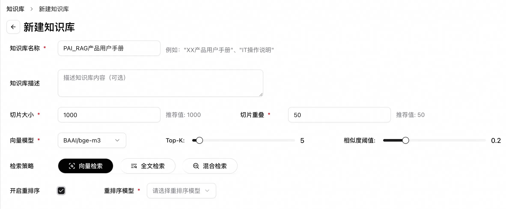

### 3. 点击"创建", 创建知识库
### 4. 文件管理

   点击"上传文件", 选择本地文件，进行上传。

   上传结束后，可在"状态"一栏下查看上传状态。

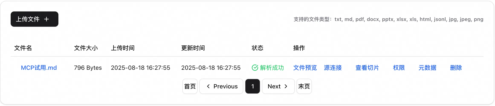

#### a. 点击"文件预览"，可查看原文件。

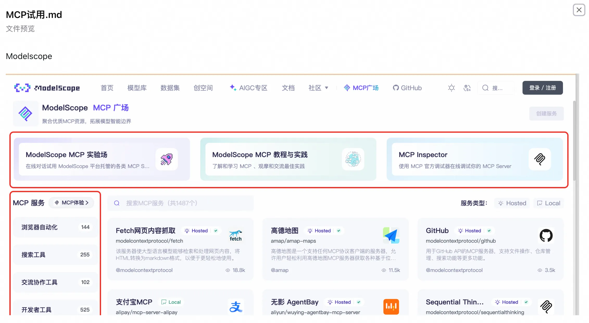

#### b. 点击"源链接"，添加文件的外部链接。

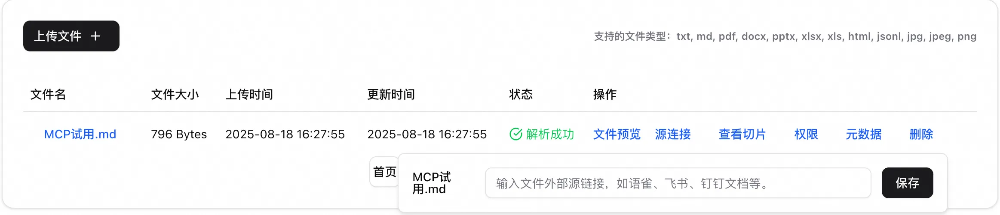

#### c. 点击"查看切片"，可查看文件切片。可点击按钮决定chunk是否激活，未激活的chunk不会被检索召回。

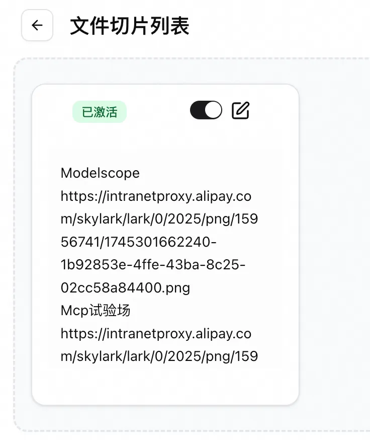

可编辑chunk内容

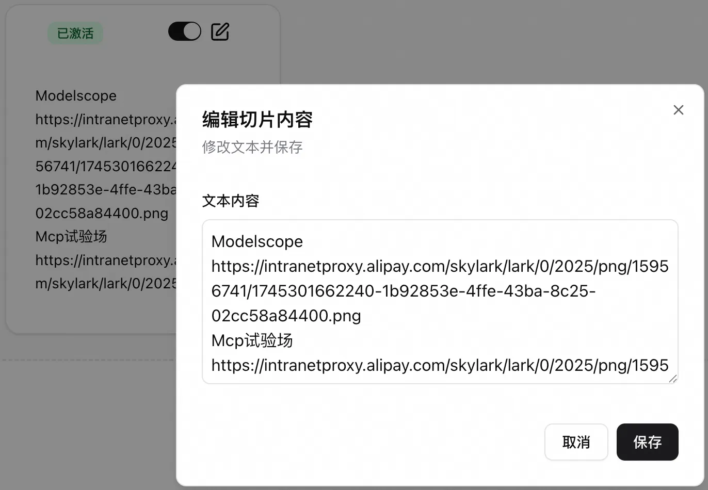

#### d. 文件权限查看并设置

 点击“权限”，查看并设置文档权限。

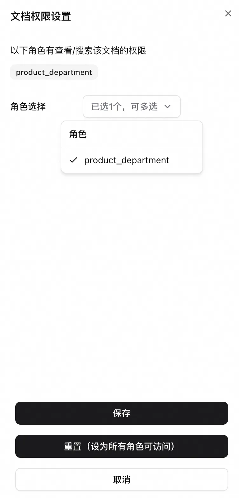

#### e. 文件元数据查看并设置

点击“元数据”，查看并设置文档元数据。

点击“编辑”，点击“添加”，可添加元数据。前提：在知识库设置页面添加了元数据。

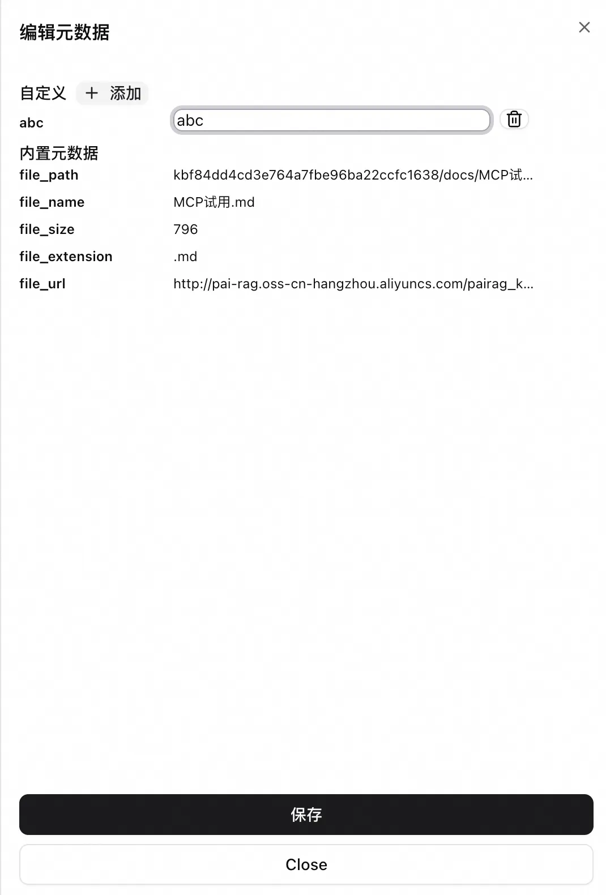

#### f. 删除文件

点击"删除",删除文件。

### 5. 知识库设置

创建知识库后，可编辑知识库。点击知识库卡片，编辑以下字段，并点击"保存设置"

| **配置项**       | 取值示例                | 描述说明                                                                 |
|------------------|-------------------------|--------------------------------------------------------------------------|
| **知识库名称**   | PAI_RAG产品用户手册     | 自定义配置，建议名称清晰体现知识库类别（如产品手册、技术文档等），无默认值 |
| **知识库描述**   | （可选）                | 可选配置，用于补充说明知识库的具体类别（如“PAI_RAG产品操作指南”）及用途，无默认值 |
| **切片大小**     | 1000                    | 自定义配置，默认值为1000，用于设置文档切片的字符长度（控制单段切片的信息密度） |
| **切片重叠**     | 50                      | 自定义配置，默认值为50，用于设置相邻切片的重叠字符长度（避免切片间信息断裂） |
| **向量模型**     | BAAI/bge-m3             | 自定义配置，默认值为BAAI/bge-m3，用于将文本切片转换为向量的模型选择       |
| **Top-K**        | 5                       | 自定义配置，默认值为5，用于设置检索时返回的“最相似结果数量”               |
| **相似度阈值**   | 0.7                     | 自定义配置，默认值为0.2，用于过滤检索结果：仅返回相似度大于等于该值的结果     |
| **检索策略**     | 向量检索                | 三选一配置（可选策略：向量检索、全文检索、混合检索），默认值为“向量检索” |
| **开启重排序**   | 可勾选（默认不勾选）    | 开关配置，默认不勾选；勾选后需额外选择“重排序模型”，用于优化检索结果的相关性排序 |
| **元数据配置**   | 可点击右侧“添加元数据”  | 功能配置，点击操作后可自定义添加元数据字段（如文档来源、创建时间等），无默认值 |

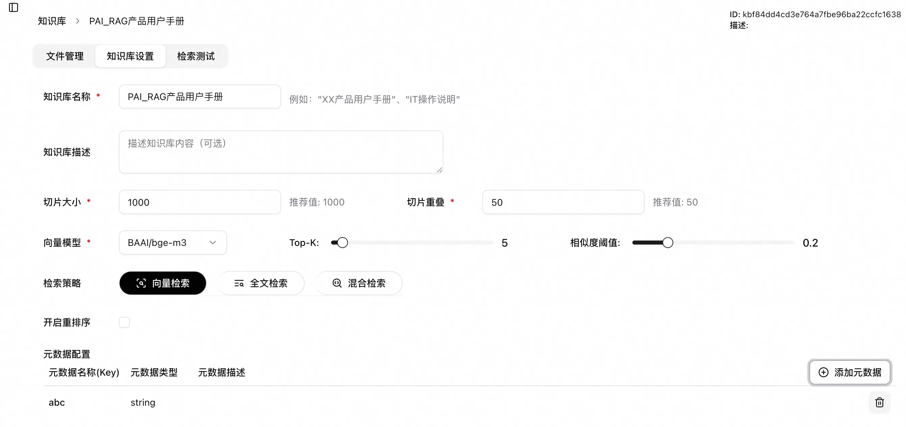

知识库可添加元数据配置。

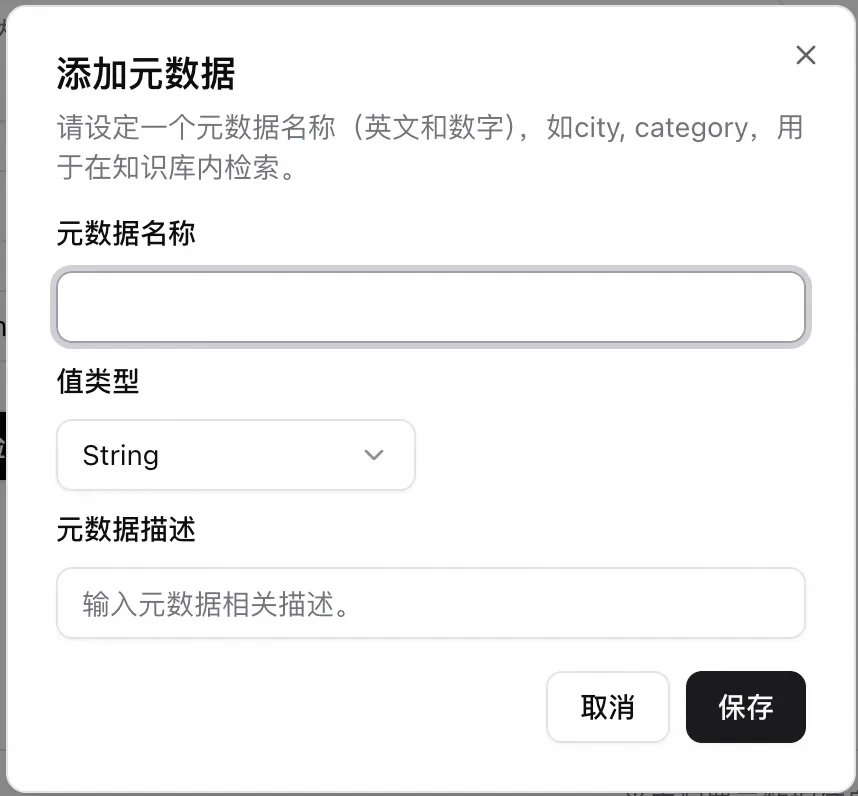

### 6. 检索测试

测试chunk检索。在输入框输入检索文字。（可选）点击元数据，配置过滤条件。（可选）输入user_id。

点击开始查询，得到查询chunk。

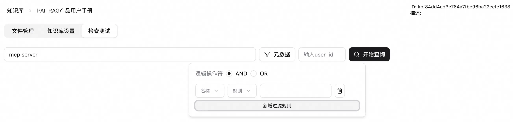

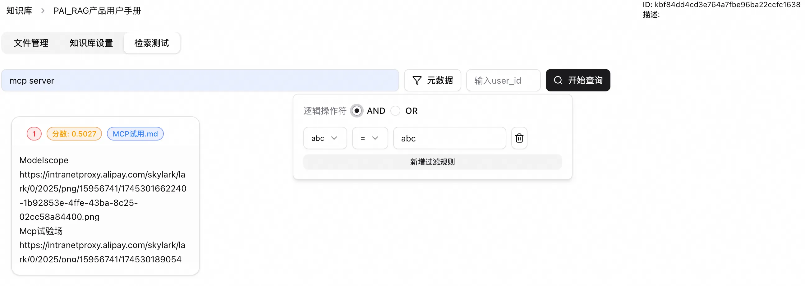

#### 元数据筛选与条件组

UI 支持通过嵌套条件组（condition_groups）构建复杂的元数据筛选逻辑：

- 选择逻辑操作符（AND/OR），点击"新建过滤规则"添加叶子条件
- 点击"新建条件组"可添加嵌套的子条件组，每个子条件组拥有独立的逻辑操作符
- 条件组支持多层嵌套（最大 5 层），适用于混合 AND/OR 的复杂场景（如 `(A OR B) AND C`）

更多 API 调用说明和示例详见 [检索 API - Metadata Condition](api/kb_file_management.md#metadata-condition-元数据筛选条件)。

### 7. 删除知识库

点击知识库左下角"垃圾桶"图标，删除知识库  
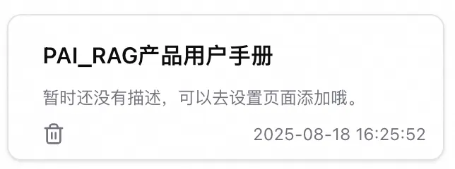

## 模型管理
### LLM模型管理
#### 1. 添加LLM模型

点击左下角 Settings（设置图标）→ 选择 Model（模型）选项卡→ 进入模型配置页面→ 点击LLM→点击添加LLM模型

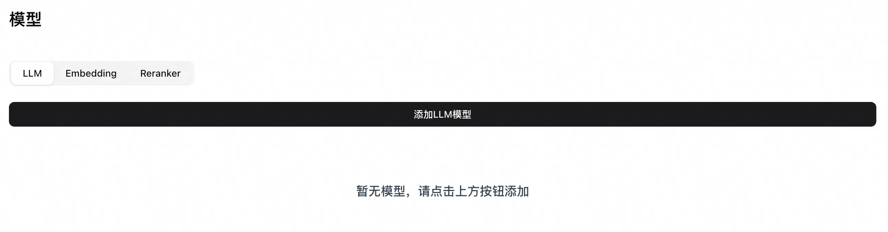

#### 2. 配置LLM模型

有思考与非思考两种模式的模型，可通过思考模型选项来控制是否思考。

| **配置项**       | 取值示例                | 描述说明                                                                 |
|------------------|-------------------------|--------------------------------------------------------------------------|
| **模型ID**       | qwen-test               | 自定义配置，用于标识该模型的唯一ID（如“qwen-test”“chatglm-test”），无默认值 |
| **Endpoint URL** | https://dashscope.aliyuncs.com/compatible-mode/v1 | 按实际模型填写，需为OpenAI兼容的API端口（通常以“/v1”结尾），无默认值     |
| **API Key**      | your_api_key            | 填写实际模型的API密钥（用于接口鉴权），无默认值                           |
| **模型名称**     | qwen-max                | 按实际模型填写，用于明确模型的具体版本/类型（如“qwen-max”“gpt-4”），无默认值 |
| **多模态模型**   | 不勾选（默认不勾选）    | 开关配置，默认不勾选；若模型支持图片、音频等多模态输入/输出，需勾选       |
| **思考模型**     | 不勾选（默认不勾选）    | 开关配置，默认不勾选；若模型用于“逻辑推理、步骤拆解”等思考类任务，需勾选 |

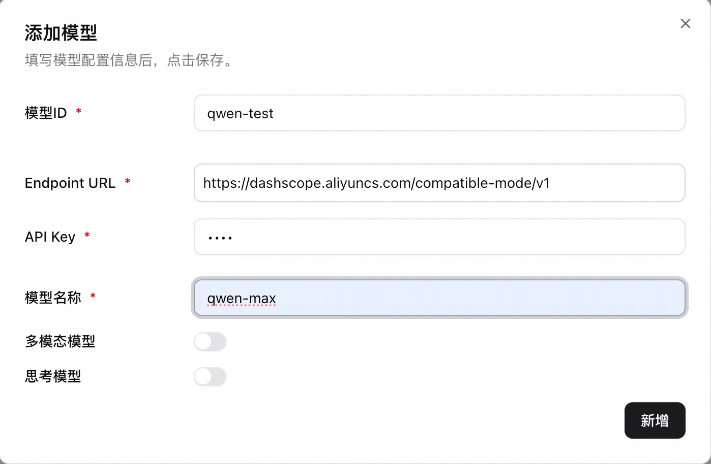

#### 3. 完成添加

点击新增，完成添加

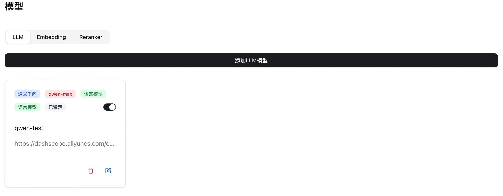

#### 4. 编辑和删除

点击模型卡片右下角的"垃圾箱"删除模型，点击模型卡片右下角的"编辑"编辑模型。

### Embedding模型管理
#### 1. 添加Embedding模型

点击左下角 Settings（设置图标）→ 选择 Model（模型）选项卡→ 进入模型配置页面→ 点击Embedding→点击添加Embedding模型。在启动时默认添加了BAAI/bge-m3 Embedding模型。

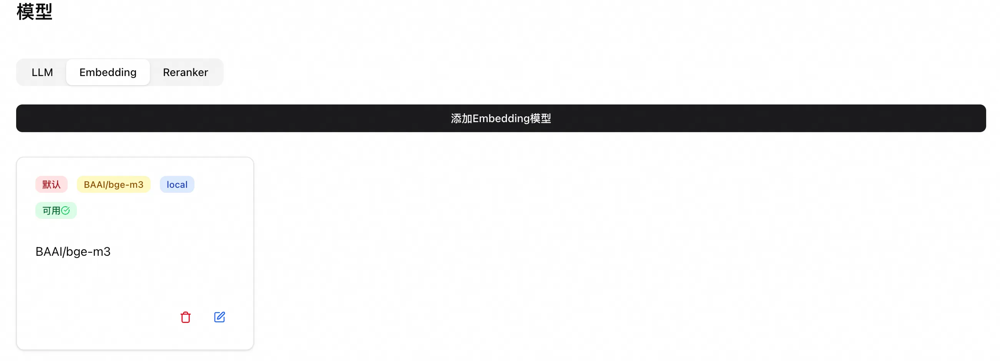

#### 2. 配置Embedding模型

本地模式：根据模型名称自动从modelscope上下载

| **配置项**       | 取值示例                | 描述说明                                                                 |
|------------------|-------------------------|--------------------------------------------------------------------------|
| **模型ID**       | custom_embedding        | 自定义配置，用于标识本地向量模型的唯一ID，无默认值                       |
| **模型名称**     | BAAI/bge-reranker-v2-m3 | 按ModelScope上的实际模型名称填写，用于明确本地部署的向量模型类型，无默认值 |
| **模型类型**     | 本地                    | 取值“本地”，标识该模型为本地部署（非API调用模式），无默认值           |
| **向量维度**     | （可填）                | 可选配置，填写模型输出向量的维度（如768、1024），无默认值                 |
| **向量Batch大小**| （可填）                | 可选配置，填写模型批量处理向量的数量（控制处理效率），无默认值             |
| **默认向量模型** | 不勾选（默认不勾选）    | 开关配置，默认不勾选；勾选后该模型成为系统默认使用的向量模型               |

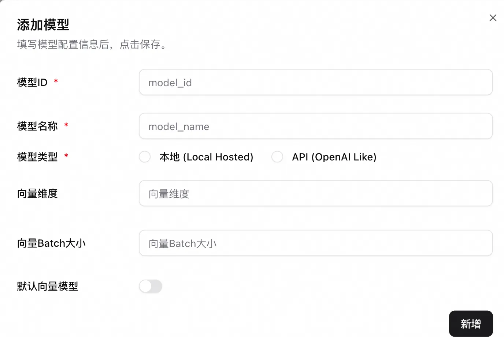

API模式：根据API调用模型

| **配置项**       | 取值示例                | 描述说明                                                                 |
|------------------|-------------------------|--------------------------------------------------------------------------|
| **模型ID**       | custom_embedding        | 自定义配置，用于标识API调用型向量模型的唯一ID，无默认值                   |
| **Endpoint URL** | https://dashscope.aliyuncs.com/compatible-mode/v1 | 按实际模型的API地址填写，用于连接向量模型的接口，无默认值                 |
| **API Key**      | your_api_key            | 填写实际模型的API密钥（用于接口鉴权），无默认值                           |
| **模型名称**     | text-embedding-v4       | 按实际模型名称填写，用于明确API调用的向量模型类型（如“text-embedding-v4”），无默认值 |
| **模型类型**     | API                    | 取值“API”，标识该模型为API调用模式，无默认值           |
| **向量维度**     | （可填）                | 可选配置，填写模型输出向量的维度（如1536），无默认值                      |
| **向量Batch大小**| （可填）                | 可选配置，填写模型批量处理向量的数量（控制API调用效率），无默认值          |
| **默认向量模型** | 不勾选（默认不勾选）    | 开关配置，默认不勾选；勾选后该模型成为系统默认使用的向量模型               |

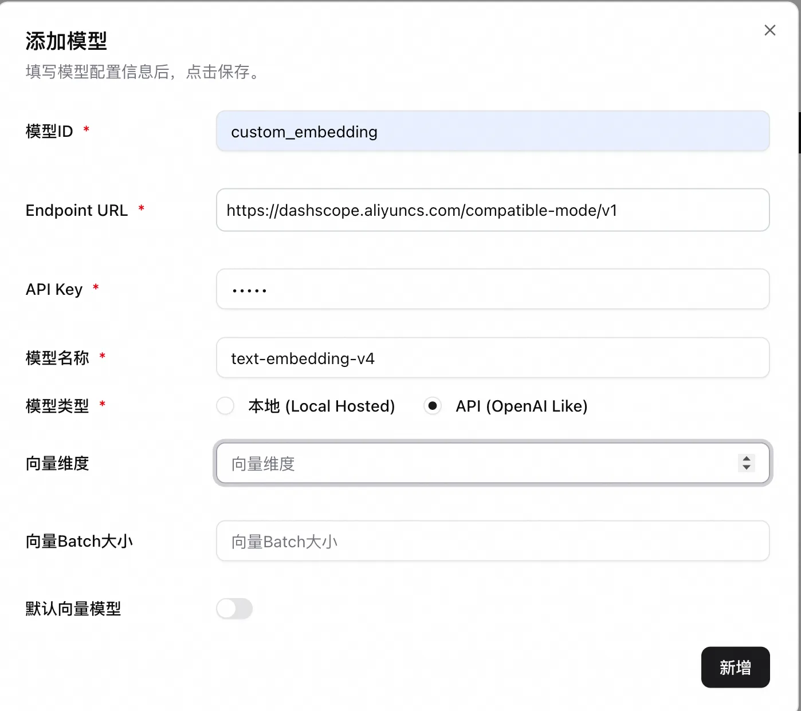

#### 3. 完成添加

点击新增，完成添加

#### 4. 编辑和删除

点击模型卡片右下角的"垃圾箱"删除模型，点击模型卡片右下角的"编辑"编辑模型。

### Reranker模型管理
#### 1. 添加Reranker模型

点击左下角 Settings（设置图标）→ 选择 Model（模型）选项卡→ 进入模型配置页面→ 点击Reranker→点击添加Reranker模型。

#### 2. 配置Reranker模型

| **配置项**       | 取值示例                | 描述说明                                                                 |
|------------------|-------------------------|--------------------------------------------------------------------------|
| **模型ID**       | custom_reranker         | 自定义配置，用于标识重排序模型的唯一ID，无默认值                         |
| **模型名称**     | Qwen3-Reranker-0.6B     | 按实际模型名称填写，用于明确重排序模型的具体版本/类型，无默认值           |
| **Base URL**     | https://api.deepinfra.com/v1/inference/Qwen/Qwen3-Reranker-0.6B | 按实际模型的接口地址填写，用于连接重排序模型的API，无默认值               |
| **API Key**      | your_api_key            | 填写实际模型的API密钥（用于接口鉴权），无默认值                           |

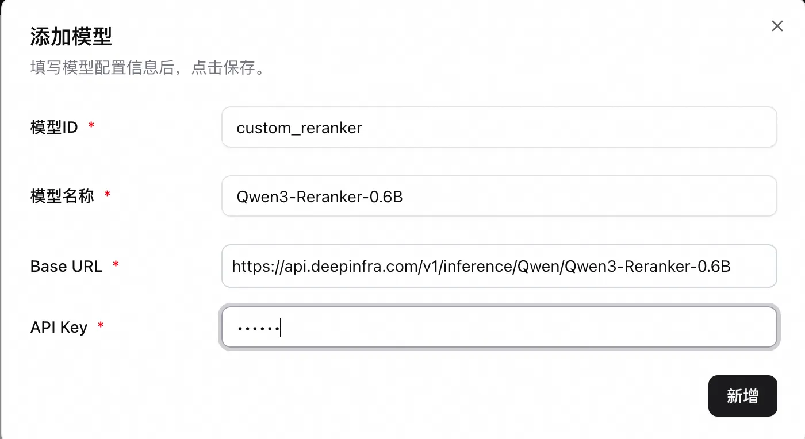

#### 3. 完成添加

点击新增，完成添加

#### 4. 编辑和删除

点击模型卡片右下角的"垃圾箱"删除模型，点击模型卡片右下角的"编辑"编辑模型。

## MCP管理
### 1. 新建MCP工具

点击左下角 Settings（设置图标）→ 选择 MCP选项卡 → 进入MCP配置页面 → 点击添加MCP

### 2. 配置MCP工具。填写完下面字段后，点击添加，添加成功。

| **配置项**       | 取值示例                | 描述说明                                                                 |
|------------------|-------------------------|--------------------------------------------------------------------------|
| **MCP名称**      | amaps                   | 自定义配置，用于标识MCP服务的名称（如“amaps”“weather-mcp”），无默认值     |
| **MCP链接**      | https://mcp-server-amap-jitptfyoyw.cn-hangzhou.fcapp.run/sse | 按实际MCP服务的地址填写，用于连接MCP接口，无默认值                       |
| **MCP类型**      | sse                     | 按实际MCP服务的通信类型填写（此处示例为“SSE”，即服务器推送事件），无默认值 |
| **Bearer Token** | （可选）                | 可选配置，填写MCP服务的验证信息（用于接口鉴权），无默认值                 |
| **默认启用**     | 勾选（默认勾选）        | 开关配置，默认勾选；勾选表示系统默认启用该MCP服务，不勾选则停用           |

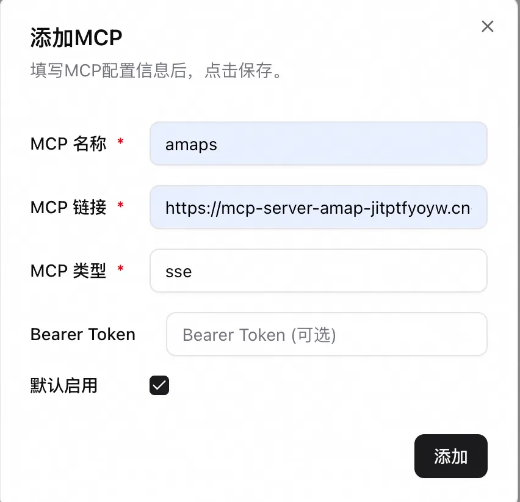

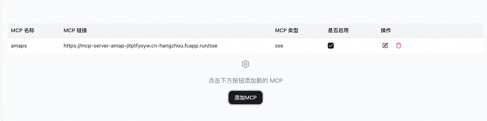

### 3.编辑MCP工具。点击MCP右侧的操作编辑图标，对MCP进行编辑。
### 4. 删除MCP。点击MCP右侧的操作删除图标，删除MCP。

## 搜索管理
### 1. 配置搜索工具

点击左下角 Settings（设置图标）→ 选择 搜索 → 进入搜索配置页面 → 配置搜索 → 点击保存搜索配置保存

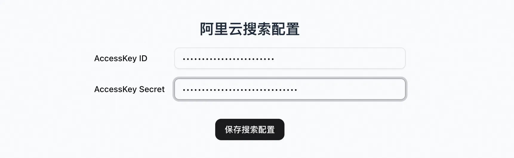

## Prompt管理
### 1. 查看Prompt

点击左下角 Settings（设置图标）→ 选择 Prompt → 进入Prompt配置页面

pai_rag有一套默认prompt，用户可根据需求修改prompt。

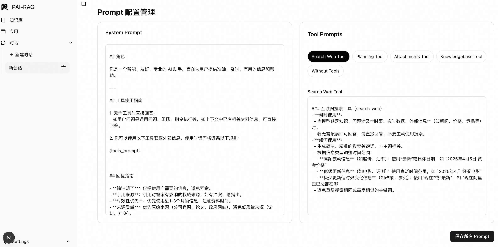

### 2. 修改Prompt

选中待修改Prompt，进行编辑。编辑好后，点击右下角保存所有Prompt，更新Prompt。prompt里{}的内容不要改动。

## 链路追踪管理
### 1. 配置链路追踪

点击左下角 Settings（设置图标）→ 选择 链路追踪 → 进入链路追踪配置页面 → 配置链路追踪 → 保存链路追踪配置

| **配置项**       | 取值示例                | 描述说明                                                                 |
|------------------|-------------------------|--------------------------------------------------------------------------|
| **Endpoint**     | http://tracing-analysis-dc-hz.aliyuncs.com:8090 | 按实际追踪服务的链接填写，用于连接追踪接口，无默认值                     |
| **Token**        | private_token_abc       | 按实际追踪服务的Token填写（用于接口鉴权），无默认值                       |
| **ServiceName**  | test_gpu                | 填写EAS服务的名称（用于关联追踪数据与具体服务），无默认值                 |
| **默认启用**     | 勾选（默认未勾选）      | 开关配置，默认未勾选；勾选表示启用追踪功能，不勾选则停用                 |

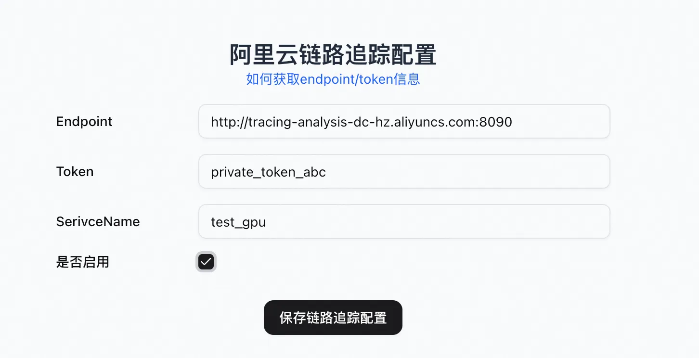

### 2. 在EAS上查看链路追踪

登录阿里云官网 → 进入人工智能平台PAI → 点击左侧 模型在线服务EAS → 选择对应region → 找到填写的EAS名称对应的服务 → 点击服务 → 点击链路追踪 → 可看到trace内容

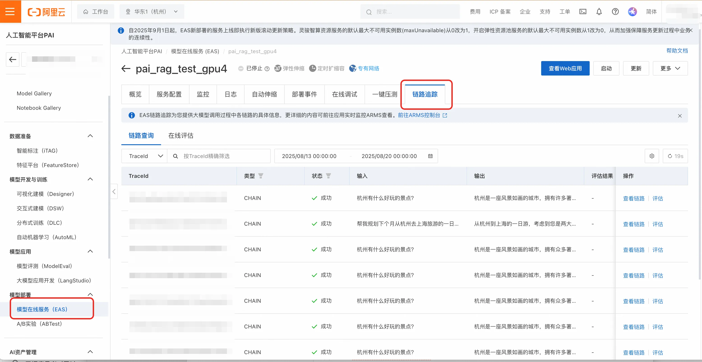

## 权限控制
权限控制可添加角色配置和用户-角色关系，可对知识库进行多粒度的权限管控。

### 1. 查看权限控制

点击左下角 Settings（设置图标）→ 选择 权限控制 → 进入权限控制页面

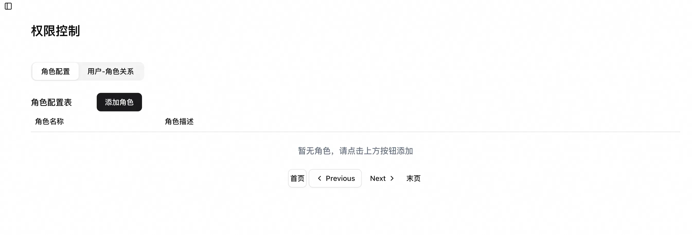

### 2. 角色配置

点击角色配置 → 选择添加角色 → 填写角色名称和角色描述 → 点击保存

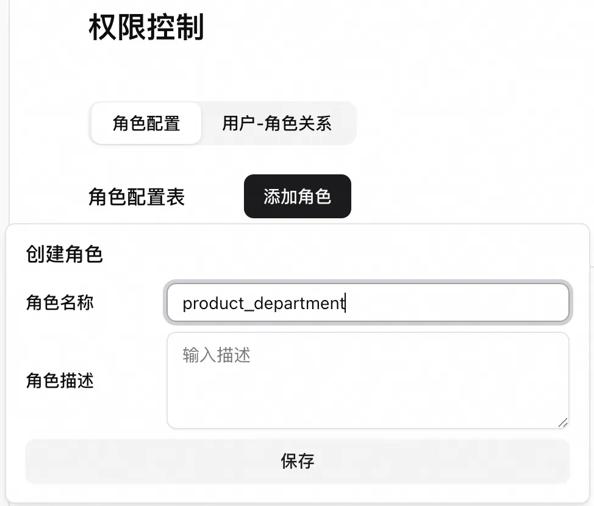

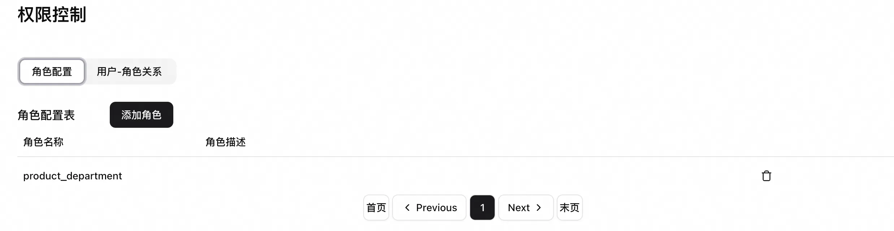

### 3. 用户-角色关系

点击用户-角色关系 → 选择添加用户角色 → 填写用户ID和选择角色名称 → 点击保存

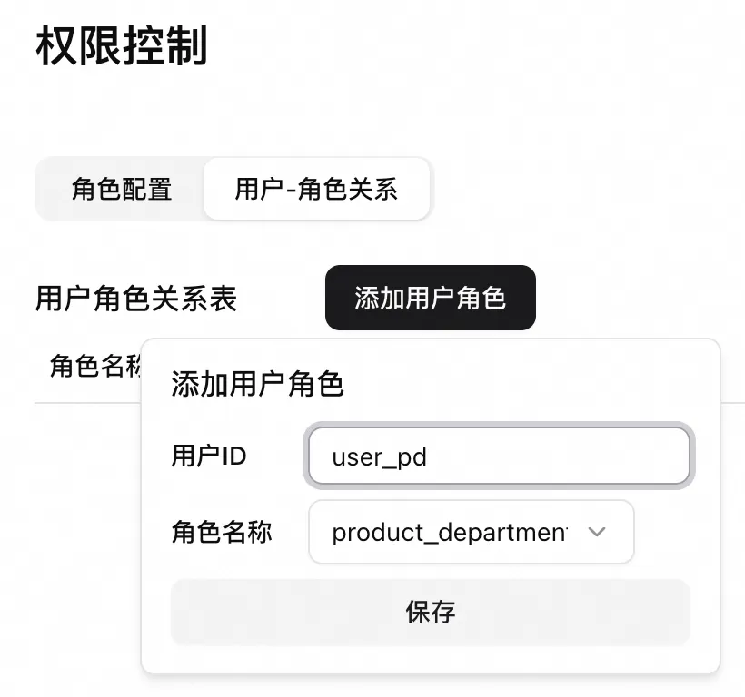

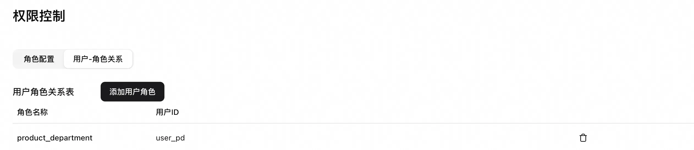

## chatbot应用管理
chat应用是一种简化调用模式的应用。一次性完成一个应用配置后，后续调用该应用进行对话无需重复设置各种配置，旨在降低用户使用门槛，快速发送请求。如需修改对话配置，直接修改应用配置，保存即可。

### 1. 新建应用

点击左侧"应用" → 点击"+新建应用"，进入应用配置

### 2. 应用配置

按照如下配置配置应用后，点击创建，创建应用。

| **配置项**       | 取值示例                | 描述说明                                                                 |
|------------------|-------------------------|--------------------------------------------------------------------------|
| **App ID**       | chatbot                 | 自定义配置，用于标识应用的唯一ID（如“chatbot”“help-center”），无默认值    |
| **描述**         | （可填）                | 可选配置，用于补充说明应用的用途（如“PAI_RAG产品客服机器人”），无默认值   |
| **基模型选择**   | qwen-max                | 需先完成模型配置，再从已配置的模型中选择（如“qwen-max”“gpt-3.5”），无默认值 |
| **启动联网搜索** | 关闭（默认关闭）        | 开关配置，默认关闭；需先配置联网搜索功能，打开后应用可实时联网获取信息   |
| **Agentic模式**  | 关闭（默认关闭）        | 开关配置，默认关闭；打开后应用进入“智能体模式”（支持自主规划、多步骤任务） |
| **知识库选择**   | 知识库测试              | 需先完成知识库配置，可从已配置的知识库中多选（如“知识库测试”“PAI_RAG手册”），无默认值 |
| **MCP选择**      | amaps                   | 需先完成MCP配置，可从已配置的MCP服务中多选（如“amaps”“weather-mcp”），无默认值 |

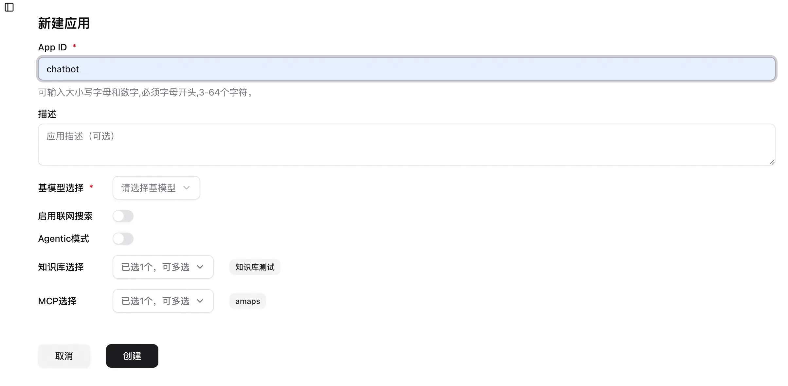

### 3. 编辑和删除

点击应用卡片左下角的"垃圾箱"删除模型，点击应用卡片编辑应用。

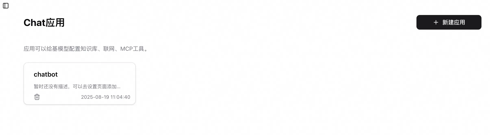

## 对话
### 1. 新建对话

点击左侧栏对话 → 新建对话，新建立一个对话

### 2. 在对话页面，选择模型或者应用进行对话。

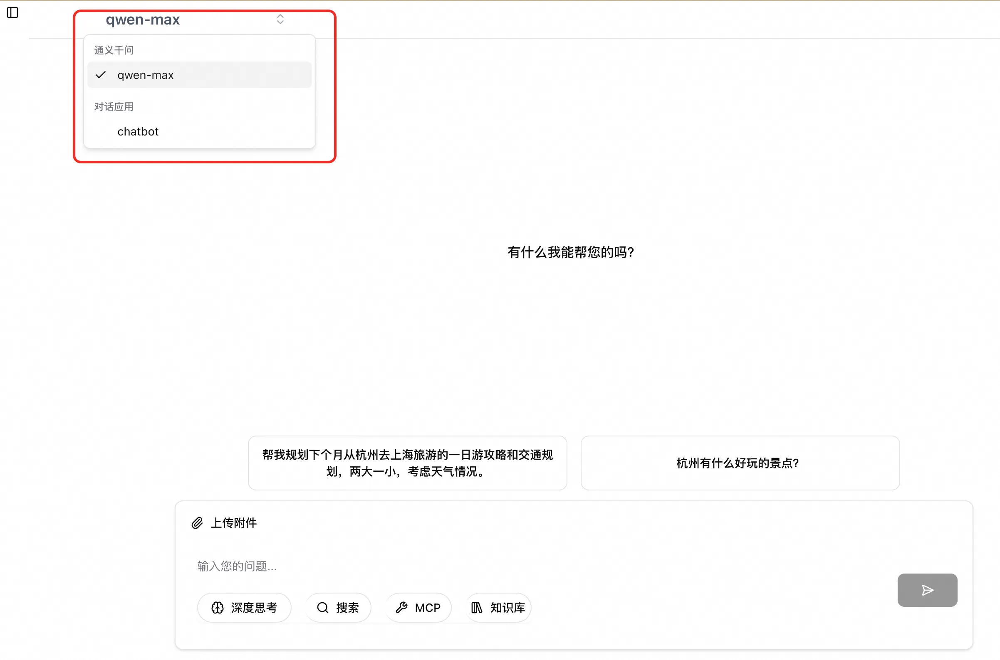

### 3. 选择模型进行对话。

选择模型进行对话的时候，对话输入栏里会有四种可选配置。根据需求，从对话输入栏里选择配置。

#### a. 深度思考：选中深度思考，对话采用agentic模式，进行多轮思考。不选中深度思考，对话采用普通单轮chat模式。

#### b. 搜索：选中搜索，在配置了搜索的情况下，对话可调用搜索工具。不选中搜索，对话不调用搜索工具。

#### c. mcp: 点击mcp，弹框展示已经配置并启用的MCP工具，选择所需的MCP工具激活，点击保存，对话可调用激活的MCP。不选中MCP激活，对话不调用MCP工具。

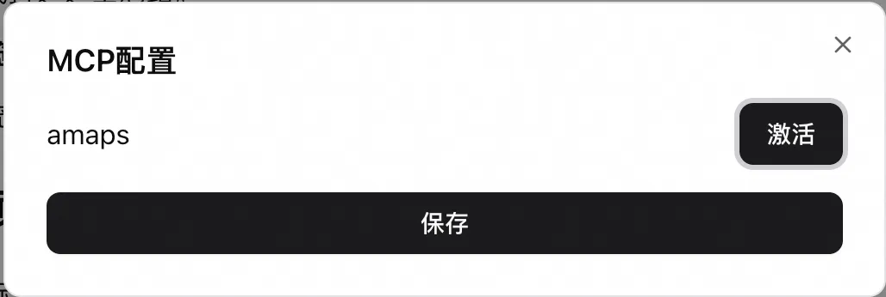

#### d. 知识库：点击知识库，弹框显示已经配置的知识库，选择所需的知识库激活，点击保存，对话可进行RAG

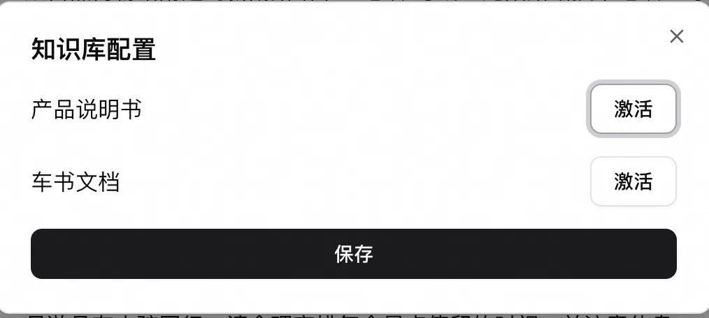

#### e.上传附件

点击输入框左上角的上传附件，可上传本地文件。支持10M以下文件上传，一次性上传不超过5个。

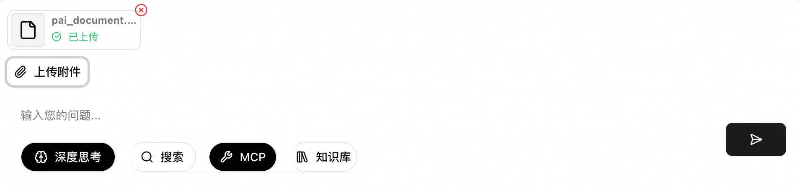

### 4. 选择应用进行对话。

选择模型进行对话的时候，对话输入栏里没有配置可选，配置是在应用中选择的。如果想要修改或者查看对话配置，请点击左侧栏应用，选择对应的应用查看。配置好chat应用后，在对话页面上方，选择对应应用进行对话。

#### a. 上传附件

点击输入框左上角的上传附件，可上传本地文件

### 5. 问答效果。

#### a.非Agentic模式：使用搜索工具

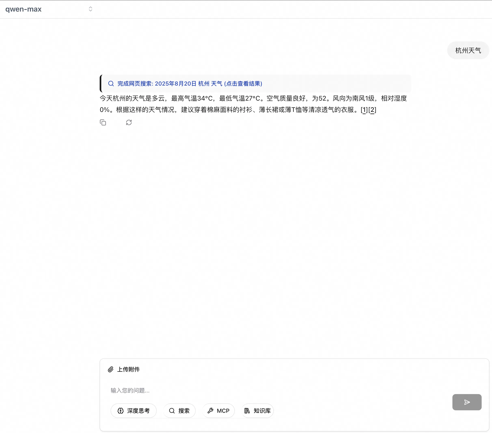

#### b.非Agentic模式：使用知识库

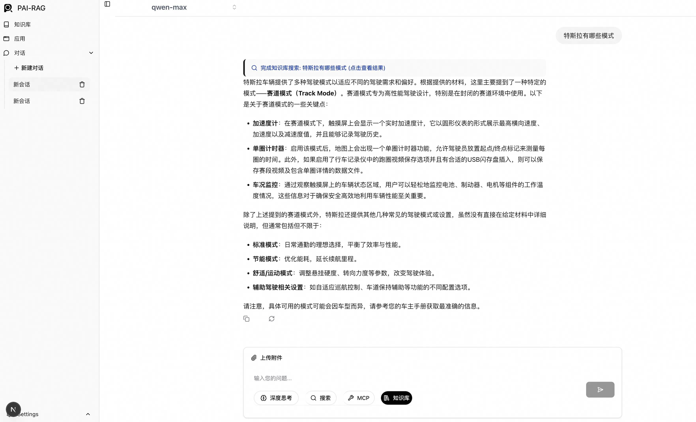

#### c.非Agentic模式：使用附件上传

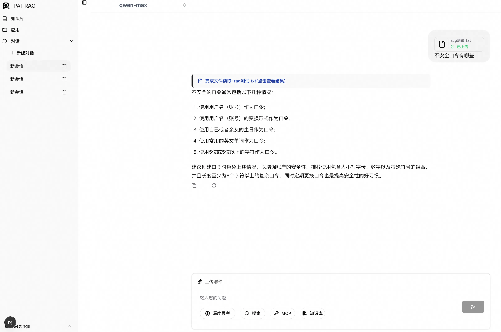

#### d.Agentic模式：使用知识库

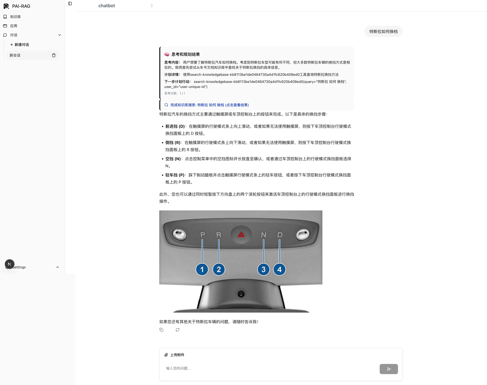

#### e. Agentic模式：使用mcp工具

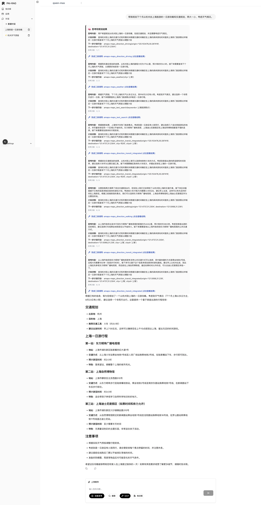

