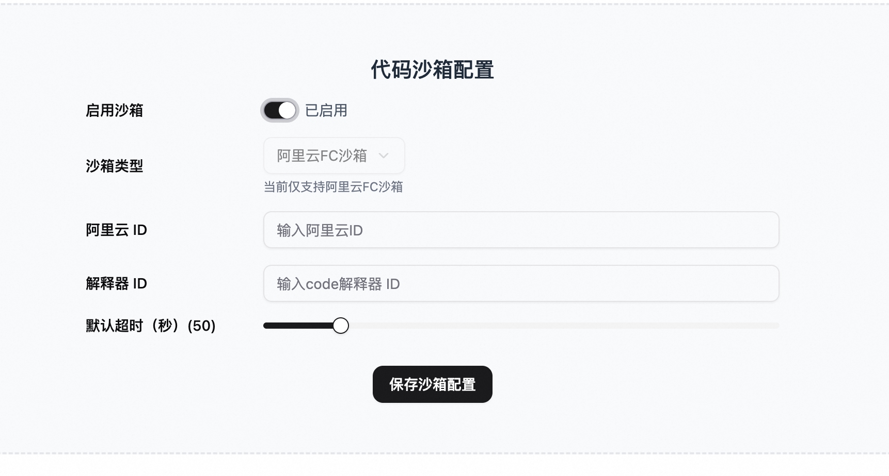
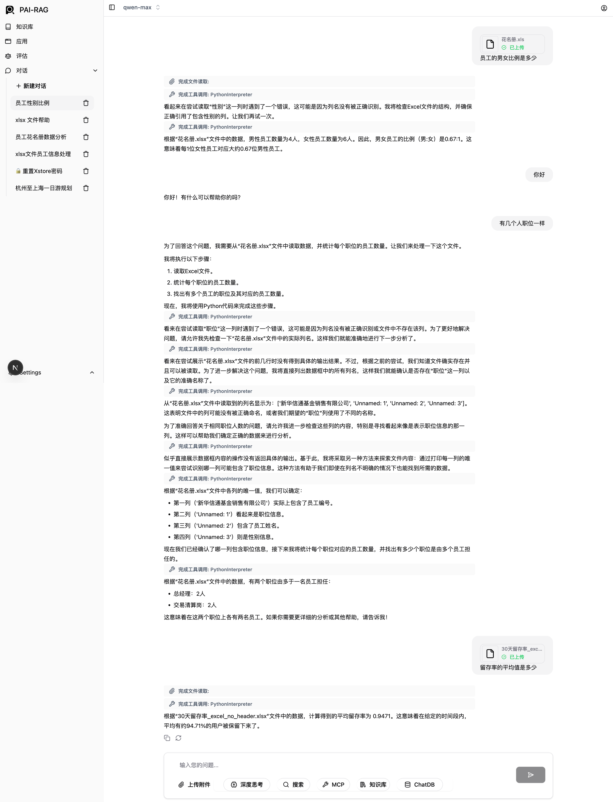

# Code 沙箱使用指南

## 概述
Code 沙箱是一个安全的 Python 代码执行环境，允许 AI 助手在隔离的环境中运行 Python 代码，执行数据分析、可视化、计算等任务。当前版本支持阿里云 FC（Function Compute）沙箱。

## 功能特性
+ ✅ 安全的 Python 代码执行环境
+ ✅ 支持文件上传和管理
+ ✅ 支持数据分析和可视化
+ ✅ 可配置的超时时间
+ ✅ 自动处理执行结果和错误信息
+ ✅ 支持图片生成和展示

## 配置说明
### 前置要求
在使用 Code 沙箱之前，您需要：

1. **阿里云账号**：拥有阿里云账号并开通[<font style="color:rgb(19, 102, 236);">函数计算</font>](https://help.aliyun.com/zh/functioncompute/fc/?spm=a2c4g.11186623.0.0.2d225e5cZHlA0t)服务
2. 登陆[<font style="color:rgb(19, 102, 236);">AgentRun控制台</font>](https://functionai.console.aliyun.com/cn-hangzhou/agent/infra?spm=a2c4g.11186623.0.0.2d225e5cZHlA0t)，并新建一个代码解释器（其中网络模式选择：公网模式）
3. **获得沙箱凭证**：
    - `aliyun_id`：阿里云账号 ID
    - `interpreter_id`：代码解释器 ID
    - `interpreter_name`：代码解释器 名称

---

## 配置步骤
### 1. 通过 Web UI 配置
1. 登录系统后，进入 **Settings** → **Code沙箱**
2. 填写以下配置项：
    - **启用沙箱**：开启/关闭沙箱功能
    - **沙箱类型**：当前仅支持 `aliyun-fc`（阿里云FC沙箱）
    - **阿里云ID** (`aliyun_id`)：您的阿里云账号 ID
    - **解释器ID** (`interpreter_id`)：代码解释器的 ID
    - **解释器名称** (`interpreter_name`)：代码解释器的 名称
    - **默认超时时间** (`timeout_default`)：代码执行的默认超时时间（秒），默认值为 50 秒
3. 点击 **保存** 完成配置



### 2. 通过 API 配置
+ 使用 POST 请求创建或更新配置：

### 示例请求

```bash
curl -X POST 'http://{API_ENDPOINT}/v1/config/code_sandbox' \
  -H 'Authorization: Bearer YOUR_BEARER_TOKEN' \
  -H 'Content-Type: application/json' \
  -d '{
    "type": "aliyun-fc",
    "aliyun_id": "your-aliyun-id",
    "interpreter_id": "your-interpreter-id",
    "interpreter_name": "your-interpreter-name",
    "enabled": true
  }'
```

查询当前配置：

```bash
curl -X GET 'http://{API_ENDPOINT}/v1/code_sandbox' \
  -H 'Authorization: Bearer YOUR_BEARER_TOKEN'
```


## 使用方式
### 在对话中使用
Code 沙箱会在 AI 助手需要执行代码时自动启用。当用户请求涉及：

+ 数据分析
+ 数据可视化
+ 数学计算
+ excel附件处理
+ 其他需要代码执行的任务

AI 助手会自动调用 Code 沙箱工具来执行相应的 Python 代码。

## 代码层（/opt/code，可选）
沙箱内除 `/mnt/system`（共享只读）、`/mnt/skills`（技能包只读）、`/mnt/user`（用户可写）三层 NAS 挂载外，还有一层**只读代码层 `/opt/code`**：一份随发布固化、**烘焙进沙箱镜像**的源码快照，其下每个子目录是一个源码仓库。之所以烘焙进镜像而非 NAS 挂载，是因为该层只做目录浏览 / grep / read，本地磁盘比 NFS 快得多。启用后：

- 沙箱内暴露环境变量 `AGENT_CODE_PATH=/opt/code`；
- 当**知识库回答不了、而问题关乎本系统自身代码行为**时，助手会 `ls /opt/code` 查看可用仓库，再用 shell / code_interpreter 以 grep、cat 探索源码作为兜底（只读，不会修改）。

**镜像侧**：`sandbox/Dockerfile` 用 `--build-arg PAIREC_CODE_ARCHIVE_URL=<归档.tar.gz>` 下载并解压到 `/opt/code`（默认指向一份 release-pinned 的 OSS 归档；置空则构建出空代码层）。更新代码 = 换归档 URL 重新构建、重新注册模板。

**服务侧**：给 `sandbox.default` 的设置打开 `code_layer_enabled: true`（部署时经 config.yaml），表示当前沙箱模板确实带了代码层——服务据此注入 `AGENT_CODE_PATH` 并加上代码探索的系统提示。为 `false`（默认）时助手收不到相关提示。每个 agent 还需自行启用 code_sandbox 工具，并可在设置页维护「代码库配置单」。完整挂载契约见 [`docs/design/skill_install_mount_dependencies.md`](design/skill_install_mount_dependencies.md)。

## 使用案例


