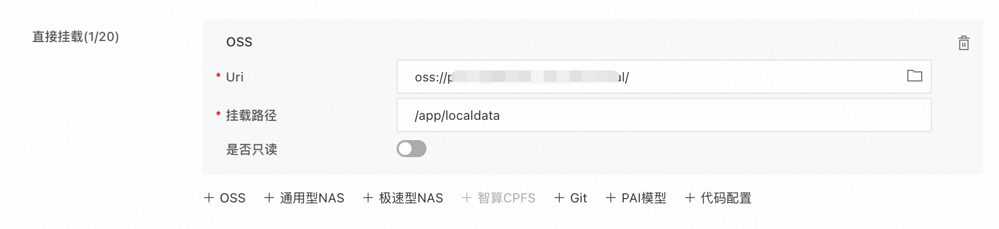

# 部署到阿里云EAS模型在线服务
[PAI-EAS](https://www.aliyun.com/product/bigdata/learn/eas)是阿里云机器学习PAI的模型在线服务平台，将模型一键部署为在线推理服务或AI-Web应用。

## 镜像repo
EAS上选择官方镜像pai-rag，版本**0.4.0**及以上，如`eas-registry-vpc.cn-hangzhou.cr.aliyuncs.com/pai-eas/pai-rag:0.4.0-20250903`

## 环境变量
#### 1. 使用CUDA加速

| 名称 | 取值 | 说明 |
| - | - | - |
| use_cuda | `true`/`false` | 是否使用CUDA加速，默认为false（开启后本地embedding模型和pdf解析效率会大大提升）|

#### 2.数据库配置

推荐使用Aliyun PostgreSQL数据库部署，默认使用本地sqlite3数据库（数据保存在本地，不支持多实例访问，重启会失效，挂载OSS目录可以实现持久化存储）

| 名称 | 取值 | 说明 |
| - | - | - |
| DB_TYPE | enum, `sqlite3`/`postgresql` | 默认为`sqlite3`，只有postgresql才需要填写下面的连接信息 |
| DB_HOST | STRING | HOST 地址，推荐使用VPC内网直连 |
| DB_PORT | STRING | 端口，默认为5432 |
| DB_USER | STRING | 用户名 |
| DB_PASSWORD | STRING | 密码 | 
| DB_NAME | STRING | 数据库名称 |

#### 3. 文件存储配置
知识库文件/图片默认存在本地目录，如果需要持久化/有多模态图片理解需求，需要配置OSS存储地址：
| 名称 | 取值 | 说明 |
| - | - | - |
| FILE_STORE_TYPE | enum, `local`/`oss` | 默认为本地，`oss`需填写下面的信息 |
| OSS_BUCKET | | OSS BUCKET名称 |
| OSS_ENDPOINT | | OSS endpoint,如oss-cn-hangzhou.aliyuncs.com |
| OSS_ACCESS_KEY_ID | | 有OSS BUCKET权限的AK |
| OSS_ACCESS_KEY_SECRET | | 有OSS BUCKET权限的SK |

#### 4. 向量检索引擎配置

推荐使用Aliyun Milvus / Elasticsearch / PostgreSQL 向量检索引擎，默认为本地chroma（数据保存在本地，不支持多实例访问，重启会失效，挂载OSS目录可以实现持久化存储）。

| 名称 | 取值 | 说明 |
| - | - | - |
| VECTOR_DB_TYPE | enum, `local`/`elasticsearch`/`milvus`/`postgresql` | 默认为`local`，如果选择其它类型请配置如下连接信息 |

- **Milvus**

| 名称 | 取值 | 说明 |
| - | - | - |
| MILVUS_HOST | STRING | HOST 地址，推荐使用VPC内网直连 |
| MILVUS_PORT | STRING | 端口，默认为19530 |
| MILVUS_USER | STRING | 用户名，如root |
| MILVUS_PASSWORD | STRING | 密码 | 
| MILVUS_DATABASE | STRING | 数据库名称，如default |

- **ElasticSearch**

| 名称 | 取值 | 说明 |
| - | - | - |
| ELASTICSEARCH_URL | STRING | 服务地址，如https://eas_host:9200 |
| ELASTICSEARCH_USER | STRING | 用户名，如elastic |
| ELASTICSEARCH_PASSWORD | STRING | 密码 | 

- **PostgreSQL**

| 名称 | 取值 | 说明 |
| - | - | - 
| POSTGRES_HOST | STRING | HOST 地址，推荐使用VPC内网直连 |
| POSTGRES_PORT | STRING | 端口，默认为5432 |
| POSTGRES_USER | STRING | 用户名 |
| POSTGRES_PASSWORD | STRING | 密码 | 
| POSTGRES_DATABASE | STRING | 数据库名称 |

## 【可选】挂载本地OSS目录
当你打算使用本地数据库和向量引擎时，为了数据持久化存储，可以选择挂载一个OSS目录，这样机器重启数据不会丢失。

本地数据目录的挂载路径为**/app/localdata**。

