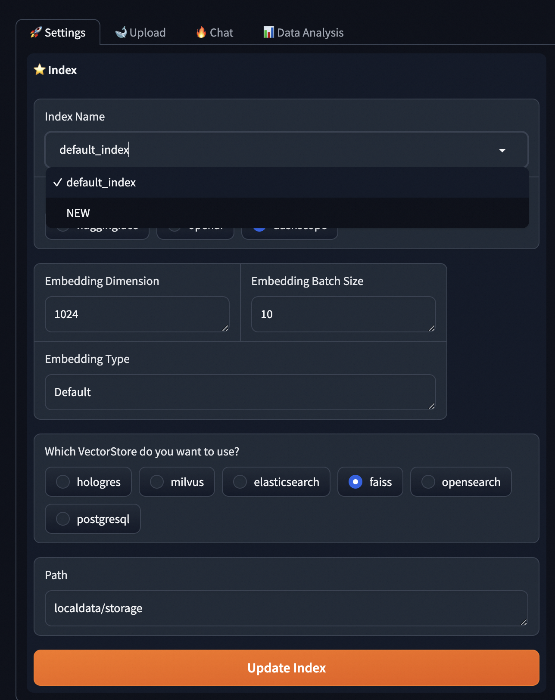
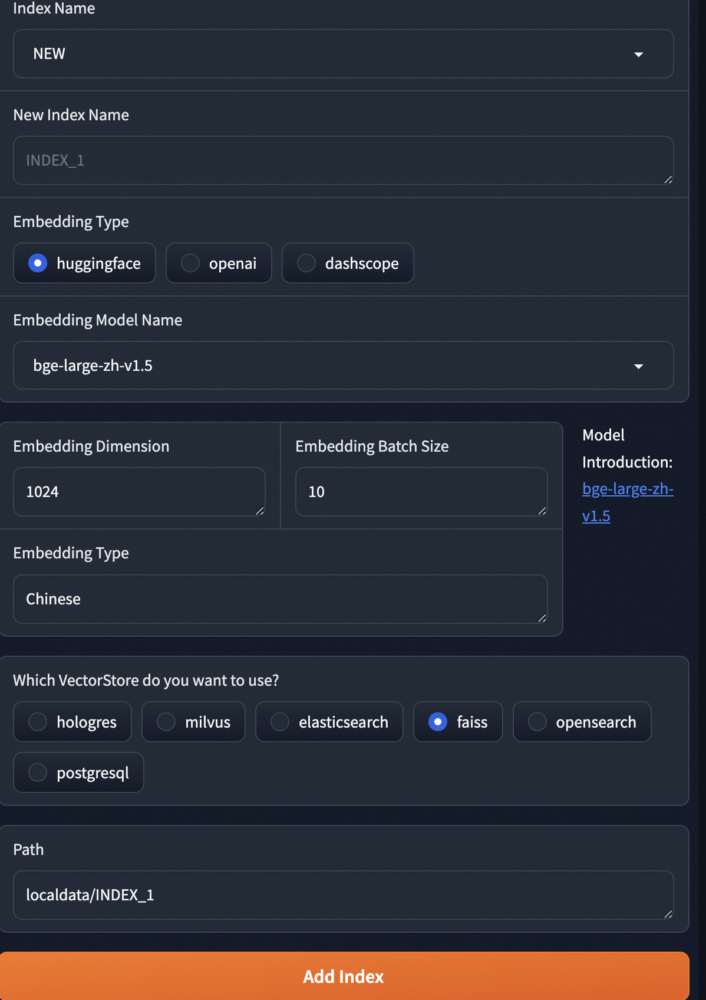
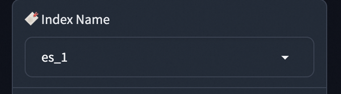

# 多知识库索引支持

当需要多个知识库来存储不同类型/业务的知识文件时，可以使用我们的多知识库支持api/ui来管理知识库索引。
目前支持以下功能：

1. 新增一个知识库index
2. 修改创建好的知识库index
3. 删除一个知识库index
4. 检索/查询对应的知识库
5. 支持不同的向量数据库后端，faiss, elasticsearch等等。

## 快速使用

可以打开UI页面快速创建、上传、检索知识库。

### 创建

1. Index下拉列表选择新建"New"

  

2. 填写索引名称，选择embedding和向量数据库类型，点击"Add Index"

  

创建完成。

### 上传知识库和查询

可以通过左边的选择器选择对应的index_name进行操作:

  

## API 使用

注意，目前查询和上传API均可以指定index_name来切换知识库，当index_name参数省略时，默认为**default_index**知识库。

目前，删除index操作仅仅支持通过API删除。

### 查询接口(Query & Retrieval)

** Retrieval **

```sh
curl -X POST http://localhost:8001/service/query/retrieval -H "Content-Type: application/json" -d '{"question": "什么是组件化", "index_name": "default_index"}'
```

** Query **

```sh
curl -X POST http://localhost:8001/service/query -H "Content-Type: application/json" -d '{"question": "什么是组件化", "index_name": "default_index"}'
```

### 上传接口(Upload)

```sh
curl -X POST http://localhost:8001/service/upload_data -H 'Content-Type: multipart/form-data' -F 'files=@/localpath/PAI.txt' -F "index_name=es_test_1"
```

### List Index

```sh
curl -X GET http://localhost:8001/service/indexes
```

### Add Index

```sh
curl -X POST http://localhost:8001/service/indexes/index3 -H "Content-Type: Application/json" -d '{"index_name":"index3","vector_store_config":{"persist_path":"localdata/storage3","type":"faiss","is_image_store":false},"embedding_config":{"source":"dashscope","embed_batch_size":10}}'
```

response:

```json
{ "msg": "Add index 'index3' successfully." }
```

### Update Index

```sh
curl -X PATCH http://localhost:8001/service/indexes/index3 -H "Content-Type: Application/json" -d '{"index_name":"index3","vector_store_config":{"persist_path":"localdata/storage4","type":"faiss","is_image_store":false},"embedding_config":{"source":"dashscope","embed_batch_size":10}}'
```

response:

```json
{ "msg": "Update index 'index3' successfully." }
```

### Delete Index

```sh
curl -X DELETE http://localhost:8001/service/indexes/index3
```

response:

```json
{ "msg": "Update index 'index3' successfully." }
```
