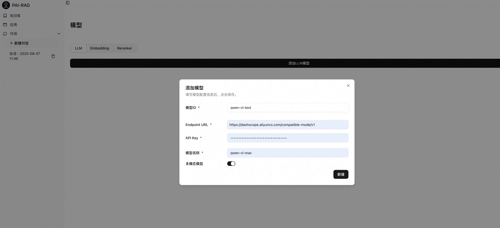
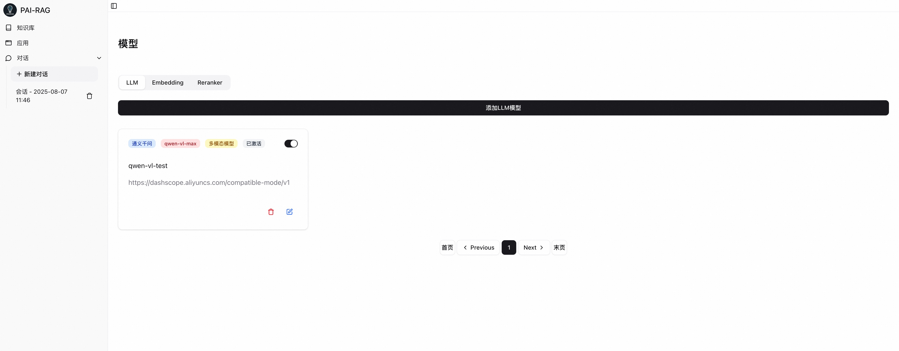
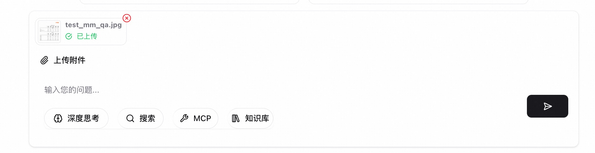
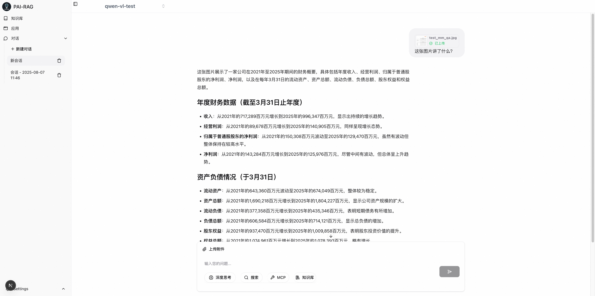

# [PAI-RAG] 使用示例：多模态附件问答

## 前置条件

- 已成功完成[安装指南](docs/quick_start.md)中的所有步骤，服务正常运行
- 应用可通过 http://localhost:8680 访问
- 准备好支持多模态的LLM模型（如Qwen-VL、LLaVA、GPT-4V等）的访问权限
- 准备测试用图片文件（支持格式：JPG、PNG、JPEG，建议大小<10MB）

## 配置多模态LLM

1. 进入模型配置页面

- 启动PAI-RAG服务后，打开浏览器访问 http://localhost:8680
- 点击左下角 Settings（设置图标）→ 选择 Model（模型）选项卡

2. 添加多模态LLM模型

- 在 LLM 标签下，点击 "添加LLM模型" 按钮
- 填写模型配置信息：

  ```bash
  模型ID: qwen-vl-test (可自定义)
  Endpoint URL: https://dashscope.aliyuncs.com/compatible-mode/v1 (根据实际模型情况填写)
  API Key: your_api_key (填写实际密钥)
  模型名称: qwen-vl-max (根据实际模型名称填写)
  多模态模型：勾选
  ```

  > **关键步骤**：务必勾选 "多模态模型"

  

- 点击 "保存" 完成配置
  

3. 验证模型配置
   配置成功后，模型列表中应显示新添加的多模态模型，状态为"已激活"

## 使用多模态附件功能

1. 创建新对话

- 点击左侧导航栏的 "新建对话" 按钮
- 在对话界面的输入框区域，点击 "上传附件" 图标（回形针形状）

2. 上传测试图片

- 选择准备好的测试图片（示例：[财报截图](https://pai-rag.oss-cn-hangzhou.aliyuncs.com/data/do_not_delete/test_mm_qa.jpg)）

  > 支持格式：JPG、PNG、JPEG
  > 大小限制：建议<10MB（取决于模型配置）
  > 典型场景：图表、文档截图、产品图片等

- 上传成功后，系统会显示 "已上传" 状态提示
  

3. 配置并发起对话

- 在对话框左上角，从模型选择下拉菜单中选择之前配置的多模态模型
- 在输入框中提出与图片相关的问题，例如：
  ```bash
  请分析这张财报图中的关键数据趋势
  用中文总结这张图表的主要内容
  ```
- 点击发送按钮，等待模型响应

4. 查看对话结果
   系统将结合图片内容进行理解生成回答，效果如下：
   

## 常见问题排查

1. 问题1：上传图片后无响应

- 可能原因：后端服务未正确处理多模态请求
- 解决方案：
  - 检查后端日志
  - 确认多模态模型配置中"多模态模型"选项已勾选
  - 验证模型服务是否支持图像输入

2. 问题2：模型无法理解图片内容

- 可能原因：模型配置不正确或模型本身不支持多模态
- 解决方案：
  - 确认使用的模型是真正的多模态模型（如Qwen-VL而非纯文本Qwen）
  - 检查API接口是否正确处理图像数据
  - 尝试使用更简单的测试图片验证基本功能

3. 问题3：上传按钮不可用

- 可能原因：前端未正确加载或权限问题
- 解决方案：
  - 刷新页面或清除浏览器缓存
  - 检查浏览器控制台是否有JavaScript错误
  - 确认应用服务端口(8680)可正常访问
