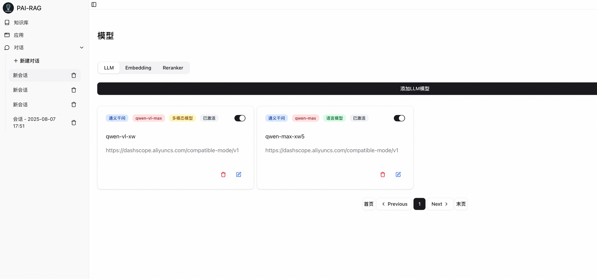
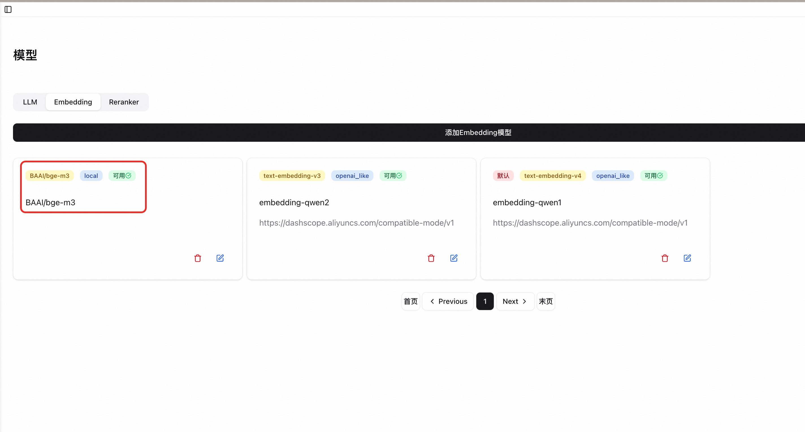
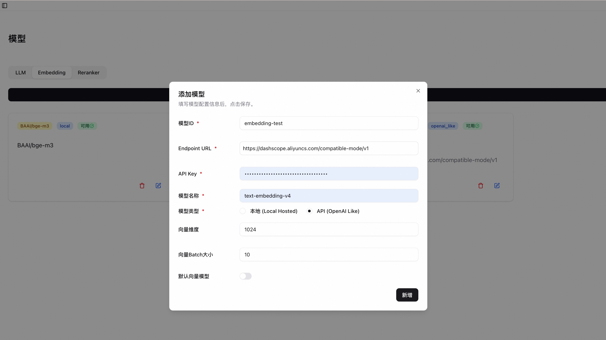
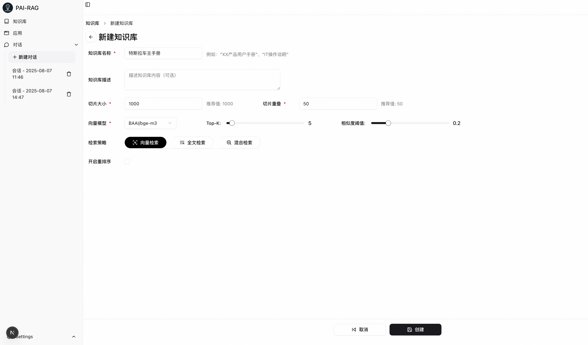
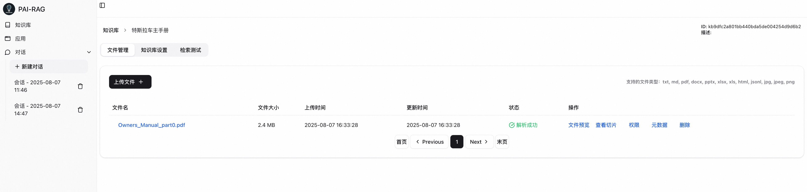
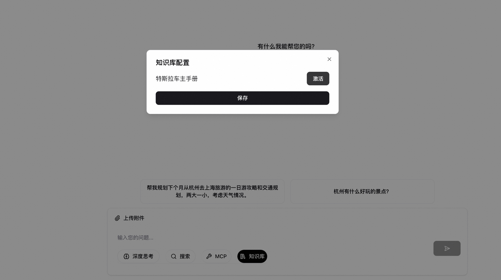
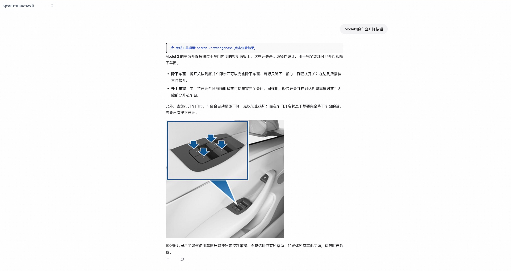
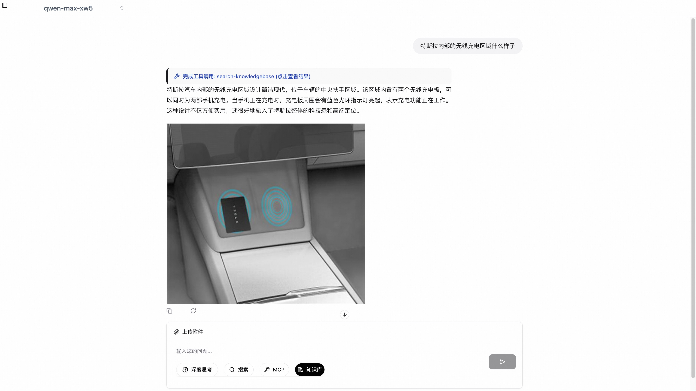

# [PAI-RAG]:多模态问答（支持知识库和附件上传）

## 前置条件

- 已成功完成[安装指南](docs/quick_start.md)中的所有步骤，服务正常运行
- 前端可通过 http://localhost:3001 访问
- 准备好支持多模态的LLM模型（如Qwen-VL、LLaVA、GPT-4V等）的访问权限
- 准备测试用图片文件（支持格式：JPG、PNG、JPEG，建议大小<10MB）

## 配置模型 (LLM 和 Embedding)

### 配置LLM

1. 进入模型配置页面

- 启动PAI-RAG服务后，打开浏览器访问 http://localhost:3001
- 点击左下角 Settings（设置图标）→ 选择 Model（模型）选项卡

2. 添加多模态LLM模型

- 在 LLM 标签下，点击 "添加LLM模型" 按钮
- 填写模型配置信息：

  ```bash
  模型ID: qwen-vl-test (可自定义)
  Endpoint URL: https://dashscope.aliyuncs.com/compatible-mode/v1 (根据实际模型情况填写)
  API Key: your_api_key (填写实际密钥)
  模型名称: qwen-vl-max (根据实际模型名称填写)
  多模态模型：勾选
  ```

  > **关键步骤**：务必勾选 "多模态模型"

  

- 点击 "保存" 完成配置
  

3. 添加LLM模型

- 在 LLM 标签下，点击 "添加LLM模型" 按钮
- 填写模型配置信息：

  ```bash
  模型ID: qwen-max-test (可自定义)
  Endpoint URL: https://dashscope.aliyuncs.com/compatible-mode/v1 (根据实际模型情况填写)
  API Key: your_api_key (填写实际密钥)
  模型名称: qwen-max (根据实际模型名称填写)
  多模态模型：**不勾选**
  ```

- 点击 "保存" 完成配置

4. 验证模型配置
   配置成功后，模型列表中应显示新添加的多模态模型和大语言模型，两个模型状态均为"已激活"
   

### 配置Embedding

1. 进入模型配置页面

- 点击左下角 Settings（设置图标）→ 选择 Embedding（向量模型）选项卡

2. 添加Embedding模型

- （推荐）PAI-RAG提供了一个内置的本地向量模型（BAAI/bge-m3），会在服务启动时自动下载，下载成功后，卡片右上角状态会从 "下载中" 变为 "可用"，此时可直接使用该向量模型。
  

- 配置其他向量模型：

  - 点击 "添加Embedding模型" 按钮
  - 填写模型配置信息：

    ```bash
    模型ID: embedding-test (可自定义)
    模型名称: text-embedding-v4 (根据实际模型名称填写)
    模型类型：(根据实际模型情况填写，选择API时需填写EndpointURL和APIKey)
    向量维度：(根据实际模型情况填写)
    向量Batch大小：(根据实际情况填写, 推荐值 10)
    默认向量模型：(根据实际模型情况勾选，若设为默认，则所有附件上传时会使用该模型)
    ```

    

  - 点击 "保存" 完成配置

3. 验证模型配置
   配置成功后，模型列表中应显示模型状态均为"可用"

## 使用知识库进行多模态问答

1. 创建知识库

- 点击左侧导航栏的 "知识库" ，进入知识库页面
- 点击右上角 "新建知识库"，填写相关信息
  - 知识库名称、知识库描述：知识库相关信息（自定义）
  - 切片大小、切片重叠：描述文档切片的大小和重叠大小
  - 向量模型：进行切片索引构建时使用的向量模型，默认使用内置的BAAI/bge-m3；其他模型需在 "Settings->Model->Embeddings" 中添加。
  - Top-K、相似度阈值：进行检索时进行过滤的参数
  - 检索策略：按需选择，推荐 "混合检索"
  - 开启重排序：按需选择，是否使用重排序模型
- 点击创建按钮，完成知识库创建
  

2. 上传图文文件

- 进入创建后的知识库详情页面，选择 "文件管理" 页签
- 点击 "上传文件"，选择准备好的文档（示例：[特斯拉车主手册部分](https://pai-rag.oss-cn-hangzhou.aliyuncs.com/data/do_not_delete/Owners_Manual_part0.pdf)）

  > 支持格式：txt, md, pdf, docx, pptx, xlsx, xls, html, jsonl, jpg, jpeg, png

  > 大小限制：建议<100MB

- 等待文件上传、解析及索引的过程完成，文件状态变为 "✅解析成功"

  

3. 配置并发起对话

- 点击左侧导航栏的 "新建对话" 按钮
- 在对话界面的输入框区域下方，点击"知识库"按钮，选择所需的知识库点击"激活"并保存
  

- 在对话框左上角，从模型选择下拉菜单中选择之前配置的大语言模型(e.g. qwen-max)
- 在输入框中提出与上传的文档及图片相关的问题，例如：
  ```bash
  Model3的车窗升降按钮
  特斯拉内部的无线充电区域什么样子
  ```
- 点击发送按钮，等待模型响应

4. 查看对话结果
   系统将自动根据问题判断是否需要知识库检索，并结合检索的内容进行理解生成回答，同时过程中会展示知识库检索的内容，问答效果如下：
   
   

## 使用附件进行多模态问答

参考[[PAI-RAG] 使用示例：多模态附件问答](mm_demo.md)

## 常见问题排查

1. 问题1：上传图片后无响应

- 可能原因：后端服务未正确处理多模态请求
- 解决方案：
  - 检查后端日志
  - 确认多模态模型配置中"多模态模型"选项已勾选
  - 验证模型服务是否支持图像输入

2. 问题2：模型无法理解图片内容

- 可能原因：模型配置不正确或模型本身不支持多模态
- 解决方案：
  - 确认使用的模型是真正的多模态模型（如Qwen-VL而非纯文本Qwen）
  - 检查API接口是否正确处理图像数据
  - 尝试使用更简单的测试图片验证基本功能

3. 问题3：上传按钮不可用

- 可能原因：前端未正确加载或权限问题
- 解决方案：
  - 刷新页面或清除浏览器缓存
  - 检查浏览器控制台是否有JavaScript错误
  - 确认前端服务端口(3001)可正常访问
