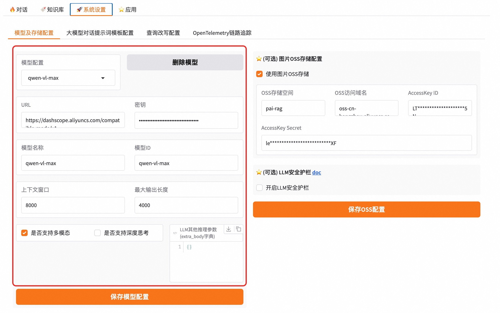
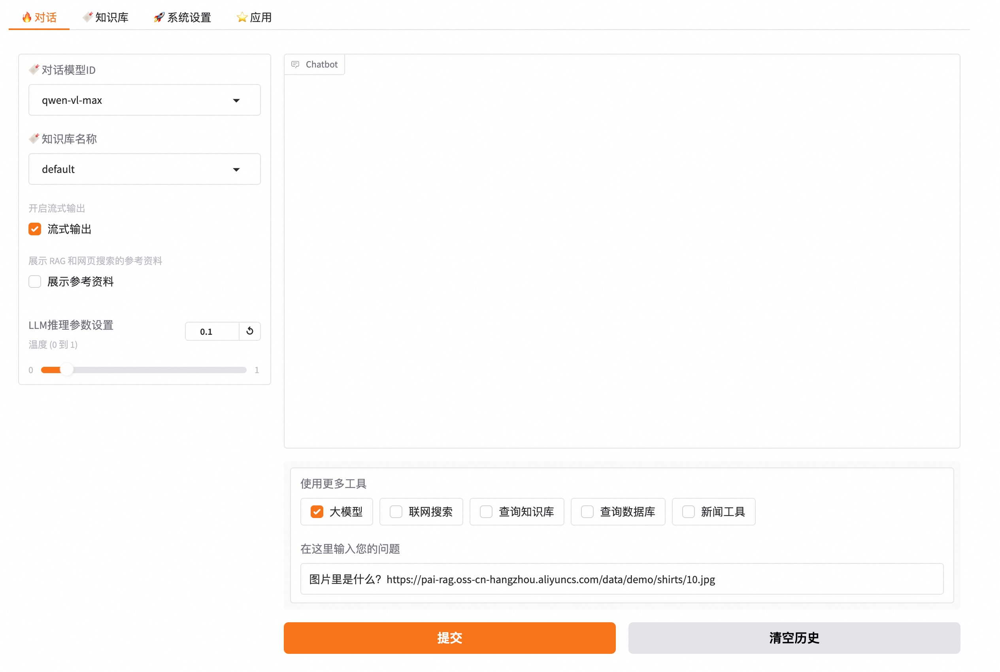
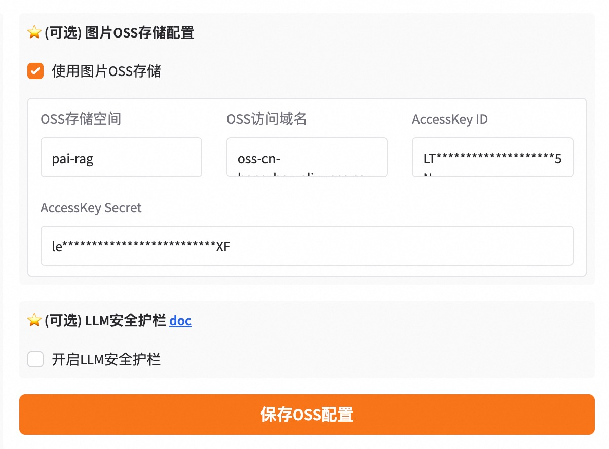
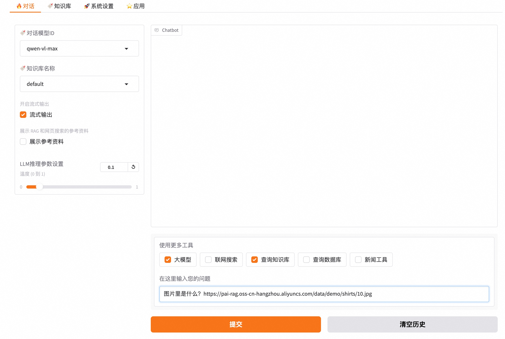

# 多模态问答

现实生活中的数据以多种模态存在，比如文本、图片、音频、视频等。我们的多模态问答功能支持文字和图片混合模式问答。

## 多模态LLM问答

当问答中的数据涉及图片信息时，可采用多模态视觉问答。

### 配置多模态LLM

首先我们需要配置多模态LLM，这里我们推荐使用DASHSCOPE VLLM，或者部署在PAI-EAS的兼容openai协议的VLLM模型，比如开源的qwen2.5-vl。
勾选上`是否支持多模态`选项
配置示例如图, 配置完保存即可。



### 调用API 进行多模态LLM问答

接来下可以调用api进行多模态的问答。在content中image_url 字段填写图片地址。

```bash
curl -X 'POST' http://localhost:8680/v1/chat/completions -H "Content-Type: application/json" -d '{
  "model": "qwen-vl-max",
  "messages": [
      {
        "role": "user",
        "content": [
          {
            "type": "text",
            "text": "图片里是什么？"
          },
          {"type": "image_url",
            "image_url": {
              "url": "https://pai-rag.oss-cn-hangzhou.aliyuncs.com/data/demo/shirts/10.jpg"}
          }
        ]
      }
    ],
    "stream": true,
    "chat_news": false,
    "search_web": false,
    "chat_knowledgebase": false,
    "index_name": "default"
}'
```

### 在gradio chat界面 进行多模态LLM问答

在gradio chat界面，输入问题和图片URL链接，模型选择多模态模型，勾选上`大模型`选项，进行问答。
示例如图。



## 多模态知识库问答

很多时候，知识库的文档中不只是纯文本信息，还包含很多图文交错的pdf、word、markdown等文件，甚至一些海报之类的纯图片文件。
普通的RAG流程会忽略这些图片输入，仅仅使用文本信息，这样会出现很多信息丢失的情况。
这里我们通过使用多模态模型来实现图文混合的多模态问答。

### 配置多模态LLM和Aliyun OSS存储

首先我们需要配置多模态LLM，参考上面配置多模态大模型内容。

然后需要添加一个Aliyun的OSS存储，来存储图片文件信息。这样在结果输出时，可以通过图片链接的方式在回复中展示图片。

配置示例如图, 配置完保存即可。



### 上传多模态文件

这里支持多种多模态文件格式，包括pdf, markdown, word, ppt, png, jpg等。在上传文件时，如果已经配置多模态LLM和Aliyun OSS存储，会自动处理文件中的图片并生成图片caption。

### 调用API 进行多模态LLM知识库问答

接来下可以调用api进行多模态的问答。在content中image_url 字段填写图片地址。index_name填写对应上传文档的知识库索引名称。

```bash
curl -X 'POST' http://localhost:8680/v1/chat/completions -H "Content-Type: application/json" -d '{
  "model": "qwen-vl-max",
  "messages": [
      {
        "role": "user",
        "content": [
          {
            "type": "text",
            "text": "图片里是什么？"
          },
          {"type": "image_url",
            "image_url": {
              "url": "https://pai-rag.oss-cn-hangzhou.aliyuncs.com/data/demo/shirts/10.jpg"}
          }
        ]
      }
    ],
    "stream": true,
    "chat_news": false,
    "search_web": false,
    "chat_knowledgebase": true,
    "index_name": "default"
}'
```

### 在gradio chat界面 进行多模态LLM知识库问答

在gradio chat界面，输入问题和图片URL链接，模型选择多模态模型，知识库名称选择上传多模态文件的对应知识库，勾选上`大模型`选项和`查询知识库`选项，进行问答。
示例如图。


