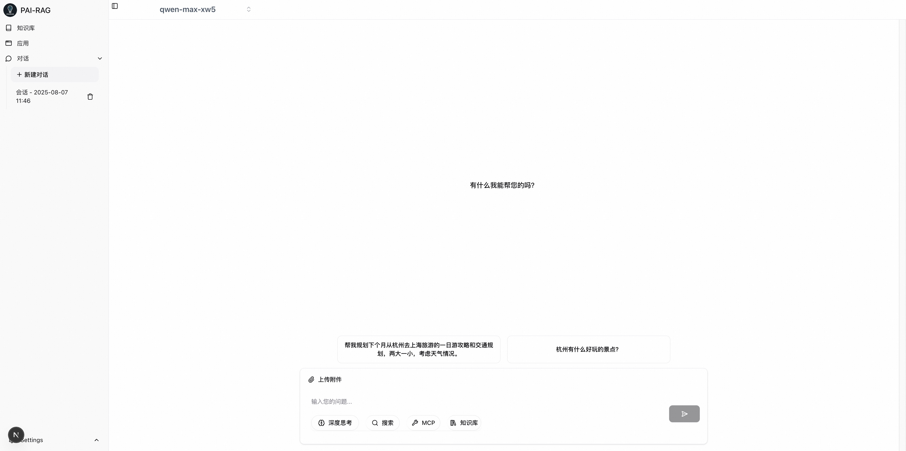

# [PAI-RAG]安装指南

## 系统要求

- Python 3.11
- Node.js 20+ (推荐使用LTS版本)
- Redis server
- Git
- Conda (推荐Miniconda)

## 快速开始

您可以通过两种方式在本地运行 PAI-RAG：Docker 环境或直接从源代码运行。


### 方式一：Docker镜像启动

1. 克隆项目代码并配置环境变量
拷贝 `.env.example` 为 `.env`，并修改对应的配置。
编辑.env文件，根据需要参考[环境变量说明](env.md)修改关键配置。

```bash
git clone https://github.com/aigc-apps/PAI-RAG.git
cd PAI-RAG/docker
cp .env.example .env
```


2. 使用docker compose命令启动服务：
```bash
docker-compose up -d
```

3. 打开浏览器中的 http://localhost:8680 访问WebUI. 第一次启动服务会下载需要的相关模型文件，需要等待5分钟左右。


### 方式二：本地源码启动

本地需要安装redis-server和node.js。
```bash
apt-get install -y nodejs npm redis-server
```

1. 克隆项目代码到本地

   ```bash
   git clone https://github.com/aigc-apps/PAI-RAG.git
   cd PAI-RAG
   ```

   > 注意：请确保已安装Git，若未安装请先安装Git再进行此步骤。

2. 创建环境并安装依赖包

   ```bash
   # 创建Python环境
   conda create -n pai-rag-env python=3.11
   conda activate pai-rag-env

   # 安装项目核心依赖
   pip install poetry
   poetry install
   ```

3. 配置环境变量
   拷贝 `.env.example` 为 `.env`，并修改对应的配置。

   ```bash
   cp .env.example .env
   ```

   编辑.env文件，根据需要参考[环境变量说明](env.md)修改关键配置。

4. 启动服务

   ```bash
   ./scripts/start.sh --dev
   ```

5. 验证安装

   服务启动后可通过 http://localhost:8680 访问，显示如下页面则表示安装部署成功，可以尽情使用了。
   

## 常见问题排查

1. 依赖安装问题

- 若poetry install失败，可尝试先运行poetry lock来锁定依赖版本
- 若遇到Node.js相关问题，确保Node.js版本符合要求

2. 环境变量问题

- 确保所有必填环境变量已正确设置，特别是API密钥类配置
- 修改.env后需重启服务使配置生效

3. 端口冲突

- 如遇端口占用，可使用其他端口：
   - --port 指定应用端口(默认: 8680)
   - --frontend-port 前端服务端口 (默认: 8681)
   - --backend-port  后端服务端口 (默认: 8682)
   ```bash
   ./scripts/start.sh --port 8680 --dev
   ```

## 注意事项

- 项目使用Poetry进行依赖管理，不推荐直接使用pip安装依赖
- 如需更新依赖，修改pyproject.toml后运行poetry lock和poetry install
