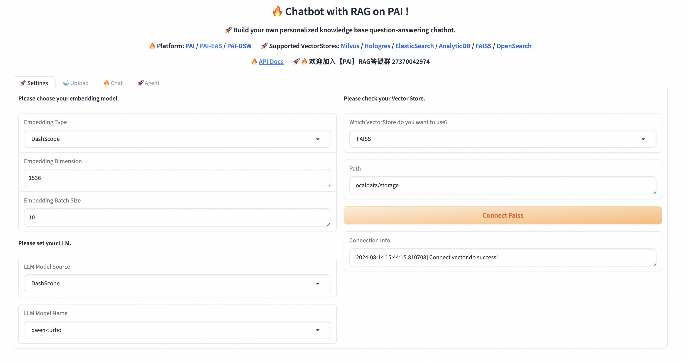
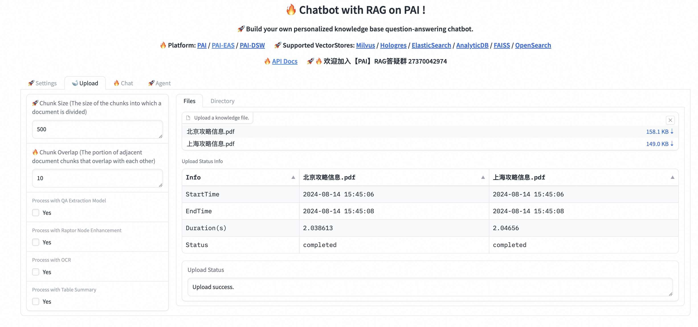
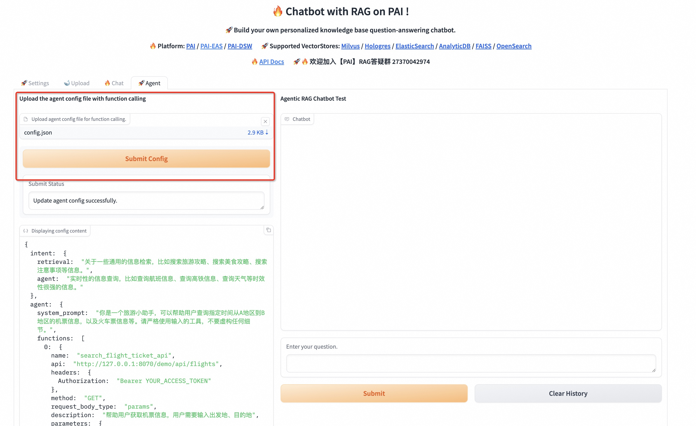
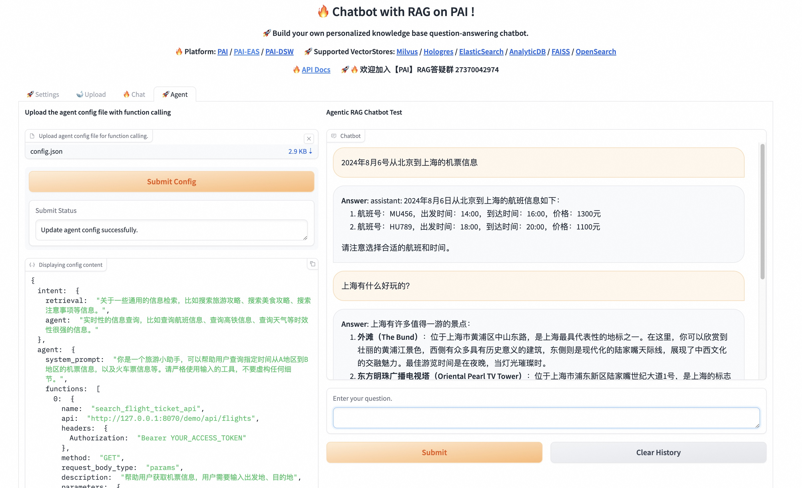

# Agentic RAG Demo Guide

此示例提供了一个旅游小助手的功能，仅用于演示Agentic RAG中如何结合意图识别和FunctionCalling达到智能旅游攻略搜索和调用外部系统API的目的。实际使用视业务情况而有所不同。

## Mock API Service

我们提供了一个使用 FastAPI 实现的简单 API 系统，包含从北京到上海的机票查询、高铁查询和上海酒店查询。这些 API 将返回我们提前设定的 mock 数据。

使用以下命令启动 FastAPI 应用：

```bash
cd example_data/function_tools/api-tool-with-intent-detection-for-travel-assistant/mock_api
python main.py
```

## PAI-RAG Service

使用以下命令启动PAI-RAG服务端：

```bash
cd PAI-RAG/
pai_rag serve -p 8071
```

## (Option-1) PAI-RAG UI

使用以下命令启动PAI-RAG WebUI：

```bash
pai_rag ui -p 8072 -c http://127.0.0.1:8071
```

在WebUI页面，在`Settings Tab`先配置好所需的模型，并点击connect进行连接。


在`Upload Tab`上传所需要的知识库内容，此例子中可以使用 **example_data/function_tools/api-tool-with-intent-detection-for-travel-assistant/dataset** 准备好的北京和上海的旅游攻略数据。


在`Agent Tab`上传Agent配置文件，此例子中可以使用**example_data/function_tools/api-tool-with-intent-detection-for-travel-assistant/config.json**，上传后点击Submit进行agent模块注册，成功后即可在右侧Chatbot中进行agent对话测试。



## (Option-2) API

若不需要使用webui，也可以直接使用API进行知识库上传和agent调用。

1. 上传知识库文件：此例子中使用 **example_data/function_tools/api-tool-with-intent-detection-for-travel-assistant/dataset** 准备好的北京和上海的旅游攻略数据。

```bash
load_data -d example_data/function_tools/api-tool-with-intent-detection-for-travel-assistant/dataset
```

2. 注册Agent相关模块：此例子中使用**example_data/function_tools/api-tool-with-intent-detection-for-travel-assistant/config.json**

```bash
curl -X 'POST' http://127.0.0.1:8071/service/config/agent -H 'Content-Type: multipart/form-data' -F 'file=@example_data/function_tools/api-tool-with-intent-detection-for-travel-assistant/config.json'
```

3. AgenticRAG对话测试

注意： API中需要显式指定 `"with_intent":"True"` 才可以调用到意图识别模块进行意图的分发。

(1) 知识库检索

```bash
curl -X 'POST' http://127.0.0.1:8071/service/query -H "Content-Type: application/json" -d '{"question":"北京旅游攻略", "with_intent":true}'

# "answer"
# 北京旅游攻略包括以下景点推荐、开放时间、特色美食、旅行建议等信息：
# 景点推荐与开放时间
# - **故宫博物院**
#   - 地址：北京市东城区景⼭前街 4 号
#   - 亮点：世界上规模最⼤、保存最完整的木质结构古建筑之⼀，珍藏大量文化遗产和珍宝。
#   - 开放时间： 旺季（4 ⽉ 1 ⽇-10 ⽉ 31 ⽇）：8:30-16:30（15:40 停⽌⼊馆） - 淡季（11 ⽉ 1 ⽇-3 ⽉ 31 ⽇）：8:30-16:00（15:10 停⽌⼊馆）
# - **天安⻔⼴场**
#   - 地址：北京市东城区东⻓安街
#   - 亮点：世界最⼤的城市⼴场，中华⼈⺠共和国的⼼脏，可观看升国旗仪式、参观⽑主席纪念堂和⼈⺠英雄纪念碑。
#   - 开放时间：全天开放
# - **天坛公园**
#   - 地址：北京市东城区天坛东⾥甲 1 号
#   - 亮点：中国古代皇帝祭天和祈年之所。
# 特色美食
# - **京酱⾁丝**  - 推荐餐厅：东来顺饭庄，位于北京市东城区东直⻔内⼤街，传统⽼字号餐馆。  - 特⾊：京酱（甜酱）炒制的猪⾁丝，颜⾊红亮，味道浓郁，常⽤⾖⽪或葱白包着吃，⼝感极佳。
# 旅行建议
# - **最佳旅游时间**：北京春秋季节⽓候宜人，适合旅游。春季（3 ⽉⾄ 5 ⽉），秋季（9 ⽉⾄ 11 ⽉）- **交通⽅式**：北京公共交通⾮常⽅便，地铁覆盖主要景点，推荐使⽤北京交通卡（Yikatong）方便出⾏。- **注意事项**：北京夏季天⽓炎热，⾼温多⾬；冬季寒冷⼲燥。建议根据季节和天⽓预报准备适合的⾐物。
# 希望以上攻略对您能有所帮助，祝您在北京玩得愉快！"
```

(2) API调用

```bash
curl -X 'POST' http://127.0.0.1:8071/service/query -H "Content-Type: application/json" -d '{"question":"2024年8月6号从北京到上海的机票信息", "with_intent":true}'

# "answer"
# assistant: 2024年8月6日从北京到上海的航班信息如下：
# 1. 航班号：MU456，出发时间：14:00，到达时间：16:00，价格：1300元
# 2. 航班号：HU789，出发时间：18:00，到达时间：20:00，价格：1100元
# 请注意选择合适的航班和时间。"
```
