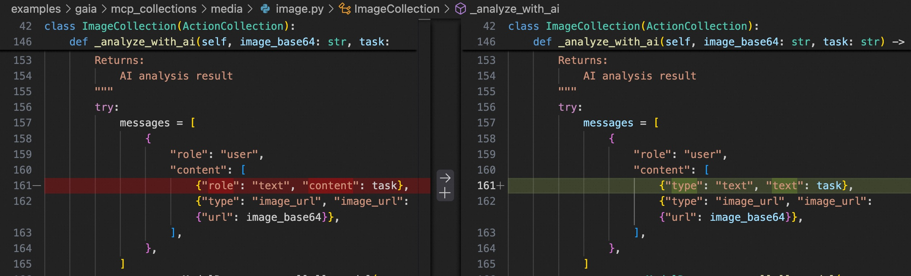
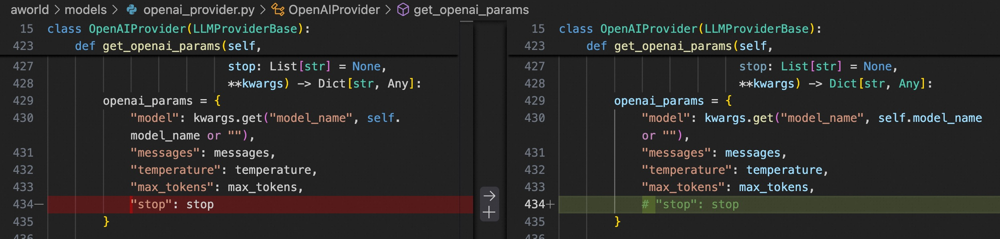

# 1. MCP Tools

复现方法
```bash
python examples/gaia/gaia_agent_runner_pairag.py --testfile experiments/test.jsonl
```

## 1.1 wikipedia:mcp_get_article_content
需要排查 `examples/gaia/mcp_collections/tools/wiki.py`

### 问题 1: Failed to retrieve Wikipedia article: Expecting value: line 1 column 1 

见 [8e867cd7-cff9-4e6c-867a-ff5ddc2550be_20250827_165136](output/output_8e867cd7-cff9-4e6c-867a-ff5ddc2550be_20250827_165136.md)

**🔧 Tool: wikipedia#mcp_get_article_content**


```tool_card
{
  "tool_type": "mcp",
  "tool_name": "wikipedia",
  "function_name": "mcp_get_article_content",
  "tool_call_id": "call_3bda52bd",
  "arguments": "{\"title\": \"Mercedes Sosa\", \"auto_suggest\": true, \"redirect\": true, \"language\": \"en\", \"output_format\": \"json\", \"include_full_content\": true}",
  "results": "[\"{\\n  \\\"success\\\": false,\\n  \\\"message\\\": \\\"Failed to retrieve Wikipedia article: Expecting value: line 1 column 1 (char 0)\\\",\\n  \\\"metadata\\\": {\\n    \\\"query\\\": \\\"Mercedes Sosa\\\",\\n    \\\"language\\\": \\\"en\\\",\\n    \\\"count\\\": 0,\\n    \\\"operation_type\\\": \\\"content_retrieval\\\",\\n    \\\"execution_time\\\": null,\\n    \\\"error_type\\\": \\\"content_retrieval_error\\\",\\n    \\\"article_id\\\": null,\\n    \\\"is_redirect\\\": null,\\n    \\\"requested_date\\\": null,\\n    \\\"actual_date\\\": null\\n  }\\n}\"]",
  "card_type": "tool_call_card_default",
  "card_data": null,
  "artifacts": []
}
```

### 问题 2: Failed to retrieve Wikipedia article: \\\\\\\"soon\\\\\\\" may refer to:

见 [e1fc63a2-da7a-432f-be78-7c4a95598703_20250827_164858](output/output_e1fc63a2-da7a-432f-be78-7c4a95598703_20250827_164858.md)

**🔧 Tool: wikipedia#mcp_get_article_content**


```tool_card
{
  "tool_type": "mcp",
  "tool_name": "wikipedia",
  "function_name": "mcp_get_article_content",
  "tool_call_id": "call_59e3ae15",
  "arguments": "{\"title\": \"Moon\", \"auto_suggest\": true, \"redirect\": true, \"language\": \"en\", \"output_format\": \"json\", \"include_full_content\": false}",
  "results": "[\"{\\n  \\\"success\\\": false,\\n  \\\"message\\\": \\\"Failed to retrieve Wikipedia article: \\\\\\\"soon\\\\\\\" may refer to: \\\\nSoon (musical)\\\\nSoon (album)\\\\nSoon (EP)\\\\n\\\\\\\"Soon\\\\\\\" (1927 song)\\\\n\\\\\\\"Soon\\\\\\\" (Tanya Tucker song)\\\\nBBC Radio One Live in Concert\\\\nI Need You\\\\nGlider\\\\nThe Gates of Delirium\\\\nMississippi\\\\nBajour\\\\nChupacabra\\\\n360° Tour\\\\nSun (surname)\\\\nLyndel Soon\\\\nWillie Soon\\\",\\n  \\\"metadata\\\": {\\n    \\\"query\\\": \\\"Moon\\\",\\n    \\\"language\\\": \\\"en\\\",\\n    \\\"count\\\": 0,\\n    \\\"operation_type\\\": \\\"content_retrieval\\\",\\n    \\\"execution_time\\\": null,\\n    \\\"error_type\\\": \\\"content_retrieval_error\\\",\\n    \\\"article_id\\\": null,\\n    \\\"is_redirect\\\": null,\\n    \\\"requested_date\\\": null,\\n    \\\"actual_date\\\": null\\n  }\\n}\"]",
  "card_type": "tool_call_card_default",
  "card_data": null,
  "artifacts": []
}
```

##  1.2 image:mcp_extract_text_ocr

### ✅[已解决] 问题1: OCR failed: Failed to load image

见 [output_cca530fc-4052-43b2-b130-b30968d8aa44_20250827_170614](output/output_cca530fc-4052-43b2-b130-b30968d8aa44_20250827_170614.md)

已验证过实际的图片目录地址是有效的

**🔧 Tool: image#mcp_extract_text_ocr**


```tool_card
{
  "tool_type": "mcp",
  "tool_name": "image",
  "function_name": "mcp_extract_text_ocr",
  "tool_call_id": "call_027288a6",
  "arguments": "{\"file_path\": \"/mnt/llm/xiaowen/47.237.112.163/forks/PAI-RAG/examples/gaia/GAIA/2023/validation/cca530fc-4052-43b2-b130-b30968d8aa44.png\", \"language\": \"eng\", \"preprocess\": true}",
  "results": "[\"{\\n  \\\"success\\\": false,\\n  \\\"message\\\": \\\"OCR failed: Failed to load image /mnt/llm/xiaowen/47.237.112.163/forks/PAI-RAG/examples/gaia/GAIA/2023/validation/cca530fc-4052-43b2-b130-b30968d8aa44.png: cannot identify image file '/mnt/llm/xiaowen/47.237.112.163/forks/PAI-RAG/examples/gaia/GAIA/2023/validation/cca530fc-4052-43b2-b130-b30968d8aa44.png'\\\",\\n  \\\"metadata\\\": {\\n    \\\"error_type\\\": \\\"ocr_error\\\"\\n  }\\n}\"]",
  "card_type": "tool_call_card_default",
  "card_data": null,
  "artifacts": []
}
```

**排查**：无法读取图片是因为使用`git clone git@hf.co:datasets/gaia-benchmark/GAIA examples/gaia/GAIA`命令从hugging face下载数据集时，图片文件的内容已损坏，是一个纯文本内容，不是二进制，导致无法正常读取图片。
**解决**：可以手动从hugging face官网下载图片文件，替换项目中对应的图片。

### ✅[已解决] 问题2: image#mcp_analyze_image_ai: Call LLM Error

**🔧 Tool: image#mcp_analyze_image_ai**


```tool_card
{
  "tool_type": "mcp",
  "tool_name": "image",
  "function_name": "mcp_analyze_image_ai",
  "tool_call_id": "call_a4115f57",
  "arguments": "{\"file_path\": \"/mnt/llm/xiaowen/47.237.112.163/forks/PAI-RAG/examples/gaia/GAIA/2023/validation/cca530fc-4052-43b2-b130-b30968d8aa44.png\", \"task\": \"Identify the chess board position and provide the FEN string\"}",
  "results": "[\"{\\n  \\\"success\\\": true,\\n  \\\"message\\\": \\\"AI Analysis Results for cca530fc-4052-43b2-b130-b30968d8aa44.png:\\\\n\\\\n**Task:** Identify the chess board position and provide the FEN string\\\\n\\\\n**Analysis:**\\\\nAI analysis failed: LLM Error (gpt-4o): Error code: 400 - {'error': {'message': \\\\\\\"[{'type': 'string_type', 'loc': ('body', 'stop', 'str'), 'msg': 'Input should be a valid string', 'input': None}, {'type': 'list_type', 'loc': ('body', 'stop', 'list[str]'), 'msg': 'Input should be a valid list', 'input': None}, {'type': 'list_type', 'loc': ('body', 'stop', 'list[list[int]]'), 'msg': 'Input should be a valid list', 'input': None}]\\\\\\\", 'type': 'invalid_request_error', 'param': None, 'code': None}}. Response: None\\\\n\\\\n**Image Info:**\\\\n- Dimensions: 775x775\\\\n- Format: PNG\\\\n- Processing time: 1.56s\\\",\\n  \\\"metadata\\\": {\\n    \\\"file_name\\\": \\\"cca530fc-4052-43b2-b130-b30968d8aa44.png\\\",\\n    \\\"file_size\\\": 63080,\\n    \\\"file_type\\\": \\\".png\\\",\\n    \\\"absolute_path\\\": \\\"/mnt/llm/xiaowen/47.237.112.163/forks/PAI-RAG/examples/gaia/GAIA/2023/validation/cca530fc-4052-43b2-b130-b30968d8aa44.png\\\",\\n    \\\"width\\\": 775,\\n    \\\"height\\\": 775,\\n    \\\"mode\\\": \\\"RGB\\\",\\n    \\\"format\\\": \\\"PNG\\\",\\n    \\\"has_transparency\\\": false,\\n    \\\"output_files\\\": [],\\n    \\\"extracted_text\\\": null,\\n    \\\"analysis_result\\\": \\\"AI analysis failed: LLM Error (gpt-4o): Error code: 400 - {'error': {'message': \\\\\\\"[{'type': 'string_type', 'loc': ('body', 'stop', 'str'), 'msg': 'Input should be a valid string', 'input': None}, {'type': 'list_type', 'loc': ('body', 'stop', 'list[str]'), 'msg': 'Input should be a valid list', 'input': None}, {'type': 'list_type', 'loc': ('body', 'stop', 'list[list[int]]'), 'msg': 'Input should be a valid list', 'input': None}]\\\\\\\", 'type': 'invalid_request_error', 'param': None, 'code': None}}. Response: None\\\",\\n    \\\"compression_ratio\\\": null,\\n    \\\"output_format\\\": \\\"ai_analysis\\\"\\n  }\\n}\"]",
  "card_type": "tool_call_card_default",
  "card_data": null,
  "artifacts": []
}
```

**排查**：AWorld中实现的OpenAI调用代码有几处BUG，已修复。
**解决**：
- 构造LLM Messages字段有误

- 输入openai params时`stop`传参有误。
